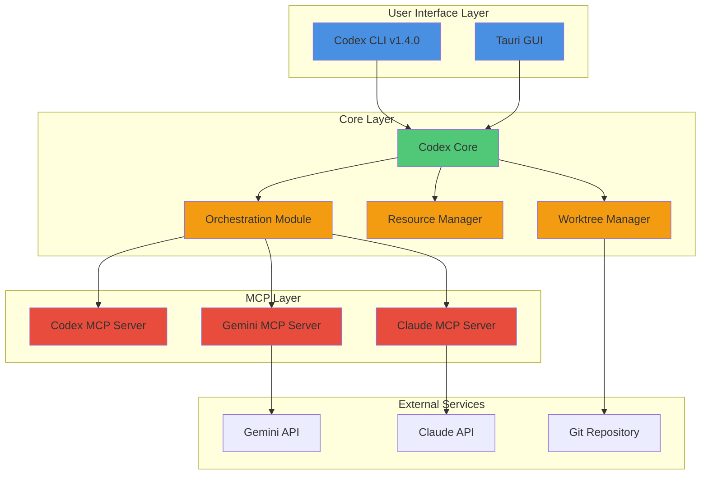
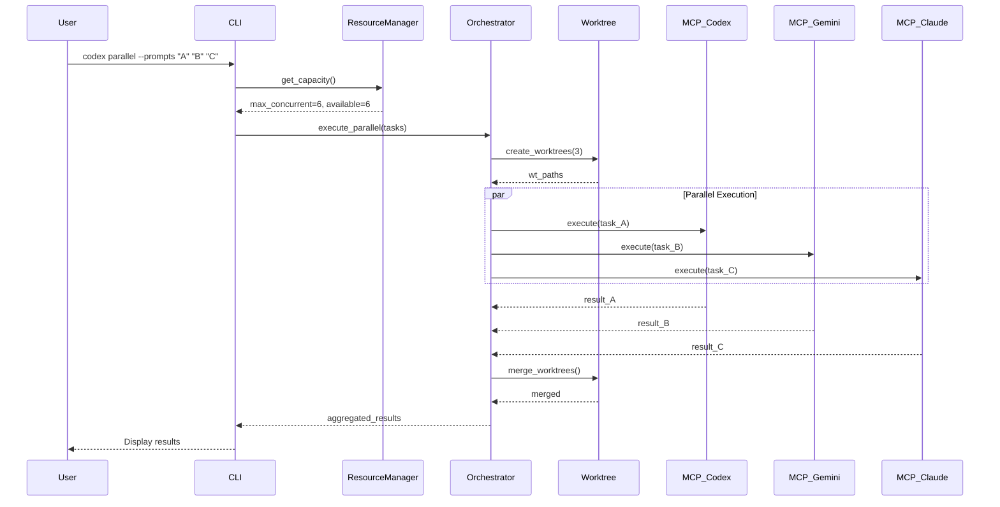
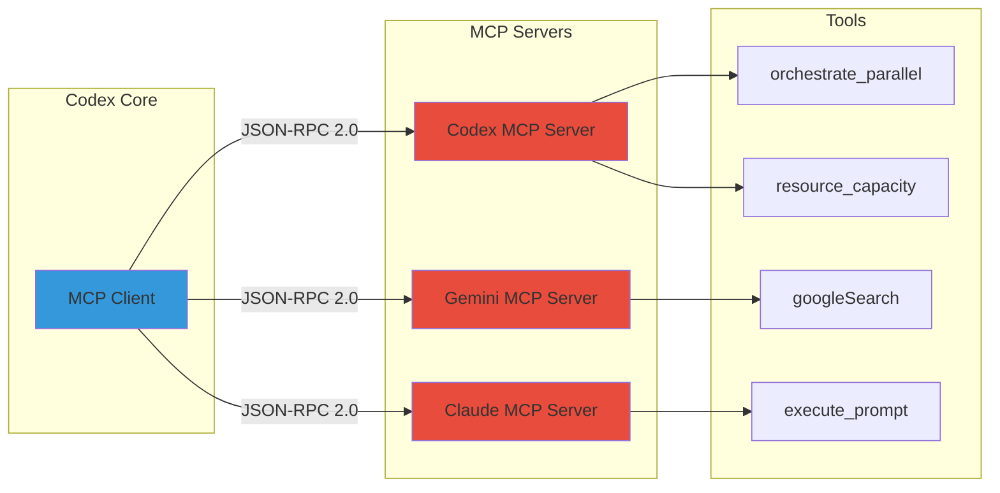
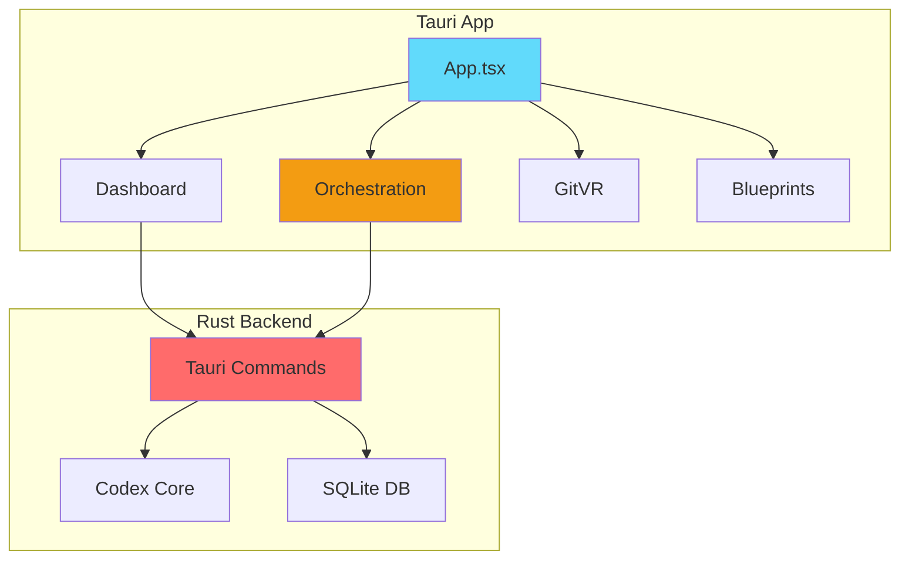

<!-- 226faf09-3224-4fd7-be2f-f868933d43ad fd31db34-8f08-4c11-bfc2-163c5672a276 -->
# Architecture Documentation & Review v1.4.0

## Overview

Codex v1.4.0 の完全なアーキテクチャレビューを実施し、Mermaid CLI を使用してアーキテクチャ図を生成。README.md を改訂して SVG 図を埋め込み、SNS (X/LinkedIn) 向けに PNG 形式でエクスポートする。

## Phase 1: 全体コードレビュー

### 1.1 プロジェクト構造分析

以下のコンポーネントを分析：

- **codex-rs/cli**: CLI エントリーポイント
  - 新機能: `parallel`, `resources`, `worktree` コマンド
  - resource_manager.rs, parallel_cmd.rs, worktree_cmd.rs

- **codex-rs/core**: コアライブラリ
  - orchestration モジュール（ResourceManager, ParallelOrchestrator, WorktreeManager）
  - mcp モジュール（既存の auth/secure_connection）

- **codex-rs/mcp-server**: MCP Server
  - codex_tools 拡張（orchestrate_parallel, resource_capacity）

- **codex-rs/gemini-cli-mcp-server**: Gemini ラッパー（既存）

- **codex-rs/claude-mcp-server**: Claude ラッパー（新規作成済み）

- **codex-rs/tauri-gui**: Tauri GUI
  - Orchestration ページ（Dynamic Agent Orchestration）
  - Dashboard（リソース表示）

### 1.2 主要機能レビュー

**v1.4.0 新機能**:

1. Dynamic Resource Management (sysinfo統合)
2. Parallel Orchestration (複数プロンプト並列実行)
3. Worktree Management (git worktree操作)
4. MCP Protocol統合（Codex/Gemini/Claude）

**既存機能**:

- Sub-agent delegation
- Deep Research
- Blueprint Mode
- Git 3D/4D Visualization
- Webhook Integration

## Phase 2: Mermaid アーキテクチャ図作成

### 2.1 システムアーキテクチャ図

**File**: `docs/architecture-v1.4.0.mmd`



### 2.2 パラレルオーケストレーション フロー図

**File**: `docs/parallel-orchestration-flow.mmd`



### 2.3 MCP プロトコル通信図

**File**: `docs/mcp-protocol.mmd`



### 2.4 GUI コンポーネント図

**File**: `docs/gui-architecture.mmd`



## Phase 3: Mermaid CLI で SVG 生成

### 3.1 Mermaid CLI インストール確認

```powershell
npm list -g @mermaid-js/mermaid-cli
```

インストールされていない場合：

```powershell
npm install -g @mermaid-js/mermaid-cli
```

### 3.2 SVG 生成

各 `.mmd` ファイルから SVG を生成：

```powershell
mmdc -i docs/architecture-v1.4.0.mmd -o docs/architecture-v1.4.0.svg -t dark -b transparent
mmdc -i docs/parallel-orchestration-flow.mmd -o docs/parallel-orchestration-flow.svg -t dark -b transparent
mmdc -i docs/mcp-protocol.mmd -o docs/mcp-protocol.svg -t dark -b transparent
mmdc -i docs/gui-architecture.mmd -o docs/gui-architecture.svg -t dark -b transparent
```

## Phase 4: PNG 生成（SNS用）

### 4.1 X（Twitter）用 PNG（1200x675）

```powershell
mmdc -i docs/architecture-v1.4.0.mmd -o docs/sns/architecture-twitter.png -t dark -b "#1a1a1a" -w 1200 -H 675
```

### 4.2 LinkedIn 用 PNG（1200x627）

```powershell
mmdc -i docs/architecture-v1.4.0.mmd -o docs/sns/architecture-linkedin.png -t dark -b "#1a1a1a" -w 1200 -H 627
```

### 4.3 汎用高解像度 PNG（2400x1350）

```powershell
mmdc -i docs/architecture-v1.4.0.mmd -o docs/sns/architecture-hires.png -t dark -b "#1a1a1a" -w 2400 -H 1350
```

## Phase 5: README.md 改訂

### 5.1 既存 README.md 読み込み

```bash
codex-rs/README.md
```

### 5.2 新セクション追加

**追加内容**:

1. **Architecture Overview** セクション

   - システムアーキテクチャ図（SVG埋め込み）
   - 主要コンポーネントの説明

2. **v1.4.0 新機能** セクション

   - Dynamic Resource Management
   - Parallel Orchestration
   - Worktree Management
   - MCP Protocol Integration

3. **Quick Start** セクション更新

   - 新しい CLI コマンドの使用例

### 5.3 SVG 埋め込み形式

```markdown
## Architecture Overview

Codex は複数レイヤーから構成されるモジュラーアーキテクチャを採用しています。


### Parallel Orchestration Flow


### MCP Protocol Communication


```

### 5.4 CLI コマンド例

````markdown
## New Features in v1.4.0

### Parallel Execution

```bash
# Execute multiple prompts in parallel
codex parallel \
  --prompts "Implement feature A" "Write tests for B" "Review C" \
  --agents codex gemini claude

# Check system resources
codex resources --verbose
````

### Worktree Management

```bash
# Create isolated worktree
codex worktree create feature-branch

# List all worktrees
codex worktree list

# Merge back to main
codex worktree merge feature-branch --strategy squash
```
````

## Phase 6: 実装ログ作成

### 6.1 実装ログファイル

**File**: `_docs/2025-11-05_MCP-Integration-v1.4.0.md`

**内容**:
- バージョン情報（1.3.0 → 1.4.0）
- 実装した機能一覧
- ファイル変更サマリー
- アーキテクチャ図へのリンク
- 使用例
- テスト結果
- 既知の問題
- 今後の展望

### 6.2 CHANGELOG.md 更新

**File**: `CHANGELOG.md`

```markdown
## [1.4.0] - 2025-11-05

### Added
- Dynamic Resource Management with CPU-based allocation
- Parallel Orchestration for concurrent prompt execution
- Worktree Management CLI commands
- MCP Protocol integration (Codex/Gemini/Claude servers)
- Enhanced Codex MCP Server with orchestration tools
- Claude MCP wrapper server

### Changed
- Workspace version updated to 1.4.0
- CLI resource manager wrapper
- Parallel execution command
- Worktree management commands

### Architecture
- New architecture diagrams (SVG/PNG)
- Updated README.md with architecture overview
- MCP protocol communication flow diagram
````

## File Changes Summary

**New Files**:

- `codex-rs/cli/src/resource_manager.rs`
- `codex-rs/cli/src/parallel_cmd.rs`
- `codex-rs/cli/src/worktree_cmd.rs`
- `codex-rs/claude-mcp-server/` (entire directory)
- `codex-rs/mcp-server/src/codex_tools/orchestrate_parallel.rs`
- `codex-rs/mcp-server/src/codex_tools/resource_capacity.rs`
- `docs/architecture-v1.4.0.mmd`
- `docs/parallel-orchestration-flow.mmd`
- `docs/mcp-protocol.mmd`
- `docs/gui-architecture.mmd`
- `docs/*.svg` (4 files)
- `docs/sns/*.png` (3 files)
- `_docs/2025-11-05_MCP-Integration-v1.4.0.md`

**Modified Files**:

- `codex-rs/Cargo.toml` (workspace version 1.4.0)
- `codex-rs/cli/src/main.rs` (new subcommands)
- `codex-rs/mcp-server/src/codex_tools/mod.rs` (new tools)
- `README.md` (architecture section, v1.4.0 features)
- `CHANGELOG.md` (v1.4.0 entry)

## Testing Checklist

1. ✅ Workspace version が 1.4.0
2. ✅ CLI コマンドが動作（parallel, resources, worktree）
3. ✅ MCP サーバーが起動（codex, gemini, claude）
4. ✅ SVG/PNG が正しく生成
5. ✅ README.md の画像が表示
6. ✅ 実装ログが完成

## Deliverables

1. **Documentation**:

   - Updated README.md with architecture diagrams
   - Implementation log (_docs/)
   - CHANGELOG.md entry

2. **Architecture Diagrams**:

   - 4x SVG files (for README.md)
   - 3x PNG files (for X/LinkedIn)

3. **Code**:

   - All v1.4.0 features implemented
   - MCP servers (Codex enhanced, Claude new)
   - CLI commands (parallel, resources, worktree)

### To-dos

- [ ] Review全体のプロジェクト構造と主要コンポーネント
- [ ] Create 4 Mermaid diagrams (architecture, flow, protocol, GUI)
- [ ] Install/verify @mermaid-js/mermaid-cli
- [ ] Generate SVG files from Mermaid diagrams (dark theme, transparent)
- [ ] Generate PNG for X/Twitter (1200x675)
- [ ] Generate PNG for LinkedIn (1200x627)
- [ ] Generate high-res PNG (2400x1350)
- [ ] Revise README.md with architecture section and SVG embeds
- [ ] Create _docs/2025-11-05_MCP-Integration-v1.4.0.md
- [ ] Update CHANGELOG.md with v1.4.0 entry