<!-- 226faf09-3224-4fd7-be2f-f868933d43ad 5a071498-a41a-465e-896d-d45cb09fe584 -->
# Codex v1.4.0 Documentation & Architecture Review

## Overview

Codex v1.4.0の実装をコードレビューし、Mermaidアーキテクチャ図を作成。README.mdを全面改訂してSVG埋め込み、SNS向けPNG出力を行う。

## Phase 1: Code Review & Analysis

### 1.1 実装の全体レビュー

実装した主要コンポーネントをレビュー：

**CLI (codex-rs/cli/)**:

- `resource_manager.rs`: ResourceManager wrapper
- `parallel_cmd.rs`: Parallel execution command
- `worktree_cmd.rs`: Worktree management
- `main.rs`: 新サブコマンド統合

**Core (codex-rs/core/)**:

- `mcp/client.rs`: JSON-RPC 2.0 MCP client (既存)
- `orchestration/`: Parallel execution & resource management

**MCP Servers**:

- `mcp-server/`: Codex MCP server (orchestration tools追加)
- `gemini-cli-mcp-server/`: Gemini wrapper (既存)
- `claude-mcp-server/`: Claude wrapper (新規作成)

### 1.2 アーキテクチャ分析

主要な設計決定：

- MCP プロトコルによる統一的なエージェント通信
- Dynamic Resource Management (CPU/Memory基準)
- Worktree による並列実行の隔離
- 3種類のエージェント (Codex/Gemini/Claude)

## Phase 2: Mermaid Architecture Diagrams

### 2.1 システム全体アーキテクチャ

**File**: `docs/architecture/system-overview.mmd`


### 2.2 CLI コマンド構造

**File**: `docs/architecture/cli-commands.mmd`


### 2.3 MCP通信フロー

**File**: `docs/architecture/mcp-flow.mmd`


### 2.4 Resource Management

**File**: `docs/architecture/resource-management.mmd`

```mermaid
graph TB
    subgraph "Dynamic Resource Management"
        SYSINFO[sysinfo crate<br/>CPU/Memory監視]
        
        RM[Resource Manager]
        
        CALC[Capacity Calculator<br/>max_workers = CPU cores * 2<br/>if CPU > 80% → reduce workers]
        
        QUEUE[Task Queue<br/>Pending/Active/Complete]
        
        SYSINFO --> RM
        RM --> CALC
        CALC --> QUEUE
        
        QUEUE --> EXEC[Execute when slots available]
        EXEC -.feedback.-> RM
    end
    
    style RM fill:#F39C12,stroke:#D68910
    style CALC fill:#3498DB,stroke:#2874A6,color:#fff
    style QUEUE fill:#9B59B6,stroke:#7D3C98,color:#fff
```



### 2.5 Worktree Isolation

**File**: `docs/architecture/worktree-isolation.mmd`


## Phase 3: Generate Diagrams

### 3.1 Mermaid CLI Setup & Generate

```bash
# Install mermaid-cli globally (if not installed)
npm install -g @mermaid-js/mermaid-cli

# Generate SVG files
mmdc -i docs/architecture/system-overview.mmd -o docs/architecture/system-overview.svg -t dark -b transparent
mmdc -i docs/architecture/cli-commands.mmd -o docs/architecture/cli-commands.svg -t dark -b transparent
mmdc -i docs/architecture/mcp-flow.mmd -o docs/architecture/mcp-flow.svg -t dark -b transparent
mmdc -i docs/architecture/resource-management.mmd -o docs/architecture/resource-management.svg -t dark -b transparent
mmdc -i docs/architecture/worktree-isolation.mmd -o docs/architecture/worktree-isolation.svg -t dark -b transparent

# Generate PNG for SNS (1200x630 for Twitter, LinkedIn)
mmdc -i docs/architecture/system-overview.mmd -o docs/architecture/system-overview-sns.png -t dark -b "#1a1a1a" -w 1200 -H 630
```

## Phase 4: README.md Revision

### 4.1 New README Structure

**File**: `README.md`

````markdown
# Codex v1.4.0 - AI Native OS

> Dynamic Multi-Agent Orchestration Platform with MCP Integration

[](https://github.com/zapabob/codex)
[](LICENSE)
[](https://www.rust-lang.org)

## 🚀 What's New in v1.4.0

### Dynamic Resource Management
- **CPU/Memory-based auto-scaling**: Automatically adjusts concurrent task limits
- **Real-time system monitoring**: Uses `sysinfo` for precise resource tracking
- **Intelligent task scheduling**: Prevents system overload

### Parallel Multi-Agent Orchestration
- **3 Agent Types**: Codex, Gemini (Google Search), Claude
- **MCP Protocol**: Unified communication via JSON-RPC 2.0
- **Git Worktree Isolation**: Conflict-free parallel execution
- **Up to 20+ concurrent agents**: Dynamic based on system capacity

### New CLI Commands
```bash
# Execute multiple prompts in parallel
codex parallel --prompts "task1" "task2" "task3" --agents codex gemini claude

# Check system resource capacity
codex resources -v

# Manage git worktrees
codex worktree create feature-branch
codex worktree list
codex worktree merge feature-branch --strategy squash
````

## 📊 Architecture

### System Overview


### Key Components

1. **Resource Manager**: Dynamic CPU/Memory-based worker allocation
2. **Parallel Orchestrator**: Task scheduling and execution
3. **MCP Layer**: Unified agent communication (JSON-RPC 2.0)
4. **Worktree Manager**: Git-based task isolation

### CLI Command Structure


### MCP Communication Flow


## 🛠️ Installation

### Prerequisites

- Rust 1.83+
- Git
- Node.js 18+ (for Mermaid CLI, optional)

### From Source

```bash
cd codex-rs
cargo install --path cli --force
codex --version  # Should show: codex-cli 1.4.0
```

### Binary Releases

Download from [Releases](https://github.com/zapabob/codex/releases/tag/v1.4.0)

## 📖 Usage Examples

### Parallel Execution

```bash
# Execute 3 tasks in parallel with different agents
codex parallel \
  --prompts "Analyze main.rs" "Search for Rust best practices" "Review architecture" \
  --agents codex gemini codex

# With worktree isolation
codex parallel --prompts "task1" "task2" --use-worktrees
```

### Resource Monitoring

```bash
# Quick capacity check
codex resources

# Detailed system stats
codex resources -v
```

### Worktree Management

```bash
# Create isolated worktree
codex worktree create feature-xyz

# List all worktrees
codex worktree list

# Merge and cleanup
codex worktree merge feature-xyz --strategy squash
codex worktree remove feature-xyz
```

## 🏗️ Architecture Details

### Resource Management


**Dynamic Allocation Algorithm**:

```rust
max_workers = CPU_CORES * 2
if cpu_usage > 80% {
    max_workers = max(max_workers / 2, 2)
}
```

### Worktree Isolation


**Benefits**:

- ✅ No git conflicts
- ✅ Parallel file modifications
- ✅ Independent branches per task
- ✅ Clean merge strategies (squash/rebase)

## 🔧 Configuration

**~/.codex/config.toml**:

```toml
[orchestration]
max_concurrent_tasks = 10  # Override auto-detection
use_worktrees_by_default = true

[resource_management]
cpu_threshold = 80  # Reduce workers above this %
memory_threshold = 85
```

## 📝 Implementation Log

Complete implementation details: [2025-11-05_MCP-Integration-v1.4.0.md](_docs/2025-11-05_MCP-Integration-v1.4.0.md)

## 🤝 Contributing

See [CONTRIBUTING.md](CONTRIBUTING.md)

## 📄 License

MIT License - see [LICENSE](LICENSE)

## 🙏 Acknowledgments

- [OpenAI Codex](https://github.com/openai/codex) - Base architecture
- [MCP Protocol](https://modelcontextprotocol.io/) - Agent communication
- [Tauri](https://tauri.app/) - GUI framework
- [sysinfo](https://github.com/GuillaumeGomez/sysinfo) - System monitoring

---

**Version**: 1.4.0

**Release Date**: 2025-11-05

**Maintained by**: zapabob

````

### 4.2 Embed SVGs in README

SVGs are embedded via relative paths:
```markdown

````

GitHub automatically renders SVG files.

## Phase 5: SNS Graphics

### 5.1 Generate PNG for X/LinkedIn

**Specifications**:

- X (Twitter): 1200x675px (16:9)
- LinkedIn: 1200x627px (1.91:1)
- Use: 1200x630px (universal)
```bash
mmdc -i docs/architecture/system-overview.mmd \
     -o docs/social/codex-v1.4.0-twitter.png \
     -t dark \
     -b "#1a1a1a" \
     -w 1200 \
     -H 675

mmdc -i docs/architecture/system-overview.mmd \
     -o docs/social/codex-v1.4.0-linkedin.png \
     -t dark \
     -b "#1a1a1a" \
     -w 1200 \
     -H 627
```


### 5.2 Add Text Overlay (Optional)

Use ImageMagick to add title/version:

```bash
convert docs/social/codex-v1.4.0-twitter.png \
  -gravity north \
  -pointsize 60 \
  -fill white \
  -annotate +0+30 "Codex v1.4.0 - AI Native OS" \
  docs/social/codex-v1.4.0-twitter-final.png
```

## Phase 6: Documentation

### 6.1 Implementation Log

**File**: `_docs/2025-11-05_MCP-Integration-v1.4.0.md`

完全な実装ログ：

- Phase 1-5 の詳細
- 技術決定の理由
- コード例
- トラブルシューティング

### 6.2 Architecture Documentation

**File**: `docs/ARCHITECTURE.md`

詳細なアーキテクチャドキュメント：

- システム設計の原則
- MCP プロトコル仕様
- Resource Management アルゴリズム
- Worktree 戦略

## Deliverables

### Files to Create/Update

**New Files**:

- `docs/architecture/system-overview.mmd`
- `docs/architecture/system-overview.svg`
- `docs/architecture/cli-commands.mmd`
- `docs/architecture/cli-commands.svg`
- `docs/architecture/mcp-flow.mmd`
- `docs/architecture/mcp-flow.svg`
- `docs/architecture/resource-management.mmd`
- `docs/architecture/resource-management.svg`
- `docs/architecture/worktree-isolation.mmd`
- `docs/architecture/worktree-isolation.svg`
- `docs/social/codex-v1.4.0-twitter.png`
- `docs/social/codex-v1.4.0-linkedin.png`
- `docs/ARCHITECTURE.md`
- `_docs/2025-11-05_MCP-Integration-v1.4.0.md`

**Updated Files**:

- `README.md` (complete rewrite)

## Testing Checklist

- [ ] All Mermaid diagrams render correctly
- [ ] SVG files display in GitHub
- [ ] PNG files meet SNS specifications
- [ ] README.md links work
- [ ] Code examples are accurate
- [ ] Version numbers are 1.4.0 everywhere

## Benefits

- **Clear Documentation**: Visual architecture diagrams
- **Professional README**: Industry-standard structure
- **Social Media Ready**: Optimized graphics for X/LinkedIn
- **Maintainable**: Mermaid source files for easy updates
- **Comprehensive**: Implementation log for future reference

### To-dos

- [ ] Install @types/three and verify React Three Fiber dependencies
- [ ] Create desktop-only Scene3D.tsx component with instanced rendering
- [ ] Create Scene4D.tsx with time-travel axis (W-dimension)
- [ ] Update GitVR.tsx page to use Scene4D component
- [ ] Remove @react-three/xr and delete VR-specific files
- [ ] Update tsconfig.json with proper Three.js types configuration
- [ ] Clean install dependencies and verify TypeScript build (0 errors)
- [ ] Build Tauri MSI and install v1.2.0
- [ ] Install @types/three and verify React Three Fiber dependencies
- [ ] Create desktop-only Scene3D.tsx component with instanced rendering
- [ ] Create Scene4D.tsx with time-travel axis (W-dimension)
- [ ] Update GitVR.tsx page to use Scene4D component
- [ ] Remove @react-three/xr and delete VR-specific files
- [ ] Update tsconfig.json with proper Three.js types configuration
- [ ] Clean install dependencies and verify TypeScript build (0 errors)
- [ ] Build Tauri MSI and install v1.2.0