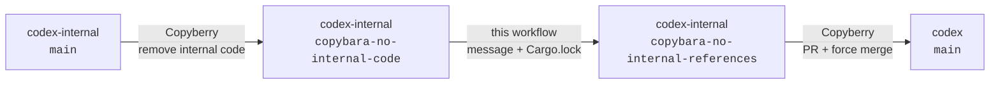

# Codex internal-to-public commit staging

This directory implements the middle phase of the Codex export pipeline. It turns one commit from
`copybara-no-internal-code` into one commit on `copybara-no-internal-references`, regenerating the
public lockfile and replacing the source message with a public-safe message written by Codex.

This directory is a self-contained internal staging bundle: it includes the Python pipeline, Codex
prompt, tests, and this documentation. The first Copyberry hop copies the entire bundle and the
matching workflow files to `copybara-no-internal-code`, where GitHub can run them.
The workflow removes the complete `.github` directory from the ready branch. The final Copyberry
hop also excludes `.github/**` from both its source and destination scopes, so `openai/codex` owns
its GitHub configuration independently.

## Pipeline



The two Copyberry jobs and this workflow have distinct responsibilities:

1. `codex-internal-no-internal-code` reads first-parent commits from internal `main`, applies the
   public file filter and marker transforms, and writes non-empty public projections to
   `copybara-no-internal-code`.
2. `.github/workflows/codex-internal-to-public-staging.yml` consumes exactly one candidate commit,
   reconciles `codex-rs/Cargo.lock`, writes a public-safe message, and appends exactly one commit to
   `copybara-no-internal-references`.
3. `codex-internal-to-codex-oss` consumes the ready branch in iterative mode. Copyberry creates and
   force-merges one public PR for each ready commit.

The workflow runs for every push to `copybara-no-internal-code`; `workflow_dispatch` is available
for recovery. Copyberry writes the source branch directly, so "push" is the precise GitHub event
even when the source commit originally reached internal `main` through a pull request. A fixed
concurrency group permits only one staging run at a time. After a successful publish, the workflow
dispatches itself once so a burst of source pushes cannot leave the final candidate in a backlog.

GitHub loads a `push` workflow from the pushed ref. The staging bundle and workflow deliberately use
names that are not excluded by the first-hop Copyberry config, so the candidate commit contains
everything needed to run it. Each internal job checks out the exact triggering revision; the model
job still receives only the public-only artifacts described below. The pipeline removes all of
`.github` before constructing the ready commit, and the final-hop Copyberry config does not read or
write that directory.

## Internal-only namespace

Keep all runtime dependencies for this workflow under one of these two patterns:

- `.github/codex-internal-to-public/**`
- `.github/workflows/codex-internal-to-public-*`

Do not add a dependency elsewhere and assume it will be safe. The first hop must copy these patterns
so the push-triggered workflow can run; the Python projection removes the complete `.github`
directory from the ready branch. The final Copyberry hop independently excludes `.github/**` from
both migration scopes, preserving the public repository's own workflows and settings.

## One-commit state machine

The ready branch contains `.codex-internal-to-public-state`. Its one line is the full SHA of the
last candidate commit represented by the ready branch tip. The state file is updated in the same
commit as the public tree and is removed by the final Copybara projection. The ready branch never
contains a `.github` directory.

For each run, `pipeline.py prepare`:

1. fetches both staging branches and reads the state file from the ready tip;
2. verifies that the recorded SHA is still an ancestor of the candidate tip;
3. selects the oldest unprocessed first-parent candidate commit;
4. creates a public-only tree for only that commit;
5. starts with the previous ready branch's `Cargo.lock`, then runs `cargo metadata` once to reconcile
   it and again with `--locked` to verify it; and
6. emits separate artifacts for model input, publication metadata, and the projected tree.

The publish job verifies that neither branch moved unexpectedly, preserves the candidate commit's
author and author date, updates the state file, and pushes with `--force-with-lease`. An empty tree
diff is still committed so the candidate-to-ready mapping remains one-to-one.

Do not add a revision trailer to the generated ready-branch message. Candidate-to-ready state stays
in the internal-only state file. On the final hop, Copybara adds its standard
`GitOrigin-RevId: <ready commit SHA>` trailer to the generated destination commit. Copyberry reads
that trailer from the PR-head commit, preserves it in the public squash commit, and uses it to find
the next ready commit on later runs. Thus the public provenance points to the sanitized ready commit,
not to internal `main`.

## Model boundary and message validation

The Codex job never checks out `openai/codex-internal` and receives no raw internal commit message.
Its repository file inputs are limited to:

- a Git bundle containing an isolated two-commit branch: a root commit with the exact prior public
  tree and a child with the exact projected tree plus a placeholder message;
- the full hash of that child commit;
- full public Codex PR or commit URLs mechanically extracted from the source message;
- the public message prompt, authoritative `message_policy.py` validator, and Codex permission
  profile; and
- a full clone of public `openai/codex` history into which the isolated branch is imported.

The synthetic branch deliberately has no internal ancestry. Its root omits the internal state file,
and both commits omit `.github`. The public repository may lag the staging branches, so the root is
not required to match the current public tip. Importing the branch into the public clone gives Codex
both the exact before-and-after trees and normal access to public history without putting an
internal checkout or internal Git object into the model job.

The two synthetic commits are not a compressed public history and may share no ancestry with
`origin/main`. Since the workflow checks out the synthetic target branch, an unqualified `git log`
shows only those two commits. The prompt tells Codex to name `origin/main` or another public ref
explicitly when researching real public history, and to use public GitHub access for pull-request
context.

The model prompt lives in `commit_message_prompt.md`; edit that file to change message policy.
Repository contents and candidate URLs are explicitly untrusted. The `public-commit-message`
profile lives in `commit_message_config.toml`. The prepare job copies it into the public-only
message artifact as the Codex configuration because the message job deliberately does not check out
the internal repo. A pre-Codex step installs it into a Codex home under `runner.temp`, outside the
workspace paths that model-invoked commands can read.

The profile gives commands read-only access to minimal runtime paths and the job workspace, with
write access limited to `message-workspace/` and `message-input/scratch/`. The workflow installs
Rust and points Cargo's home and target directories at scratch space. This lets Codex inspect and
edit the public working tree and run Cargo builds, tests, or examples while keeping the synthetic
target commit unchanged. The configuration enables the managed network proxy so its domain policy
limits requests to public GitHub, Cargo registry, and Rust distribution hosts. The job receives no
GitHub token. Its OpenAI API key comes from the protected `public-commit-message` GitHub environment,
whose deployment branch policy permits only `copybara-no-internal-code`; other jobs cannot access
that environment secret because they do not reference the environment. The workflow selects the
profile through `openai/codex-action@v1.10`, removes sudo, and runs Codex as the final step in its
job so no later step inherits its process environment. See the
[Codex permissions documentation](https://developers.openai.com/codex/permissions) when changing
the profile.

A fresh validation job parses the Markdown commit message and rejects internal repo and pipeline
names; Slack, Notion, Google Docs, and Google Drive URLs; shorthand GitHub references such as
`openai/codex#12345`; bare or abbreviated commit SHAs; and unsupported
`github.com/openai/...` URLs. Any public PR URL is checked through the GitHub API, and every public
commit URL must name a full 40-character object present in the public clone. Extracted public
references are limited to ten URLs and 2,000 bytes.

The subject should normally fit within 72 characters, but validation does not enforce that
guideline. The body is GitHub-Flavored Markdown and may use headings, lists, tables, links, and
fenced code blocks when they improve the public explanation. The body may contain at most 5,000
UTF-8 bytes. Validation writes the accepted message to `public-commit-message.md` for the publish
job.

The message-input artifact includes the same `message_policy.py` source used by the fresh validation
job. The prompt directs Codex to read it and run the executable
`check-offline message-workspace <message-file>` command before returning the message. The workflow
pre-creates `message-input/scratch/`; Codex may use it for notes, extracted snippets, Cargo caches,
intermediate drafts, and the final `public-commit-message.md`. The command enforces the same
formatting, confidentiality, URL-shape, and public-commit checks while skipping the live GitHub API
lookup for PR URLs because the model job has no token. This self-check is advisory; the independent
validation job repeats the policy with live PR verification and remains the enforcement boundary.

Always use full references such as `https://github.com/openai/codex/pull/12345` in the generated
message. Do not relax this to `openai/codex#12345`: GitHub-flavored Markdown does not hyperlink that
form consistently outside the repository.

## Cargo.lock policy

Do not run `cargo generate-lockfile` in this pipeline. Resolving from scratch needlessly updates
unrelated third-party dependencies and makes the exported commit larger and harder to review.

Instead, each run carries forward the sanitized lockfile from the previous ready commit and lets
Cargo minimally reconcile it with the candidate manifests. Before and after reconciliation, the
script rejects known internal crate and repository identifiers. `cargo metadata --locked` is the
final consistency check.

The two Copyberry hops intentionally need different lockfile rules:

- `codex-internal-no-internal-code` should preserve the existing sanitized `Cargo.lock` on the
  candidate branch because the lockfile on internal `main` contains internal packages.
- This workflow updates that preserved lockfile and commits the result to
  `copybara-no-internal-references`.
- `codex-internal-to-codex-oss` must copy the updated lockfile from the ready branch to
  `openai/codex`.

The final-hop config must not use the first hop's destination-lockfile preservation rule. Its
`PUBLIC_FILES` and `destination_files` include `codex-rs/Cargo.lock`, while both scopes exclude
`.github/**` and its source scope excludes `.codex-internal-to-public-state`.

## Bootstrap

The workflow intentionally refuses to guess a baseline. Before its first run, seed
`copybara-no-internal-references` with:

1. the public tree and sanitized `Cargo.lock` that correspond to a known commit on
   `copybara-no-internal-code`, with the complete `.github` directory omitted; and
2. a state file containing that candidate commit's full SHA.

Commit those together and push the result as the initial ready branch tip. The recorded candidate
must be an ancestor of the current candidate tip. It should represent the same public tree as the
seeded ready commit; otherwise the first generated change will silently include baseline drift.

The final Copyberry hop also needs a one-time origin baseline before it can export to an existing
`openai/codex` history. Configure or seed that mapping in Copyberry; do not add public provenance to
the generated commit message. Before enabling that hop, audit the destination's `.github` directory
and remove any internal staging files. Copyberry deliberately excludes `.github/**` from both
migration scopes, so it will preserve the audited public directory without cleaning or updating it.

## Operations and recovery

Run `Codex Internal To Public Staging` manually from the Actions UI to start or resume processing.
Normal backlog processing requires no inputs. A successful run schedules the next one; an idle run
does not.

### Manual public message override

Automated message generation fails before the ready branch advances. If Codex is unavailable or
repeatedly produces an invalid message, a maintainer can rerun the workflow with a reviewed public
message. Select
`use_public_message_override` and provide:

- `expected_candidate_revision`: the full lowercase SHA of the next unprocessed commit on
  `copybara-no-internal-code`;
- `public_subject`: the public commit subject; and
- `public_body`: an optional public commit body.

The expected revision is an optimistic-concurrency guard, not merely documentation. The run fails
if that commit is no longer next in the queue, preventing a message from being attached to the
wrong change. The override skips creation of the model's public Git workspace and does not invoke
Codex. It still passes through the same message validator, including subject and body bounds,
forbidden-reference checks, and public URL verification.

The override does not bypass projection checks. Internal paths, internal Cargo references, lockfile
reconciliation failures, invalid state ancestry, and ready-branch lease failures must be corrected
at their source. Override text is intended for publication and is recorded in the resulting commit;
do not put private context in the workflow inputs.

The Actions UI is sufficient for short messages. For a multiline body, use `gh workflow run`, for
example:

```sh
gh workflow run codex-internal-to-public-staging.yml \
  --repo openai/codex-internal \
  --ref copybara-no-internal-code \
  -f use_public_message_override=true \
  -f expected_candidate_revision="$candidate_revision" \
  -f public_subject='Describe the public change' \
  -f public_body='Explain why the public change is needed.'
```

Read the ready tip's `.codex-internal-to-public-state` value and select the first commit from
`git rev-list --first-parent --reverse <state>..origin/copybara-no-internal-code` to determine the
expected candidate. Always inspect that candidate's public projection before writing the override.

Common failures are intentionally non-destructive:

- **Missing ready branch or state file:** complete the bootstrap procedure.
- **Recorded candidate is not an ancestor:** the candidate branch was rewritten. Re-establish a
  reviewed baseline and update the ready branch and state file together.
- **Ready branch advanced during a run:** let the newer run finish, then rerun. The lease prevents
  overwriting it.
- **Cargo reconciliation failed:** fix the public projection or its manifests. Do not regenerate
  every dependency as a workaround.
- **Public reference context exceeded its model-input bound:** reduce the source references or use
  the reviewed public message override. The target commit itself is not truncated; Codex decides
  how much of its diff and surrounding repository to inspect.
- **Message validation failed:** inspect the Codex output in the validation job, tighten or clarify
  `commit_message_prompt.md`, and rerun. If the failure persists, use the reviewed public message
  override; never bypass the validator for a production export.
- **A bad ready commit was pushed:** stop the final Copyberry job before rewriting the ready branch.
  Reset the ready tip and state marker to the last known-good pair, then rerun one commit at a time.

## Local checks

Run the focused tests from the repository root:

```sh
python3 -m unittest discover \
  -s .github/codex-internal-to-public \
  -p 'test_*.py'
```

The pull-request-only workflow
`.github/workflows/codex-internal-to-public-staging-check.yml` runs the same tests whenever this
directory or either associated workflow changes.
