# Codex Architecture

Complete architecture documentation for the Codex AI-Native OS project.

## 📐 High-Level Architecture



## 🏗️ System Layers

### Layer 1: Hardware

- **CPU**: x86_64/ARM64, 16+ cores
- **GPU**: NVIDIA (CUDA 12), AMD (ROCm), Intel (oneAPI)
- **Memory**: DDR4/DDR5, 64GB+, NUMA-aware
- **Storage**: NVMe SSD, PCIe 4.0

### Layer 2: Kernel Space

#### Linux Kernel Modules

**AI Scheduler** (`ai_scheduler.ko`):
- GPU-aware process scheduling
- Priority boost for AI tasks
- Real-time latency optimization
- `/proc/ai_scheduler` interface

**AI Memory** (`ai_mem.ko`):
- 256MB pinned memory pool
- 4KB block allocation
- Zero-copy GPU transfers
- `/proc/ai_memory` statistics

**AI GPU** (`ai_gpu.ko`):
- Direct GPU DMA control
- PCI device management
- Kernel-space GPU launches
- `/proc/ai_gpu` monitoring

#### Windows Kernel Driver

**AI Driver** (`ai_driver.sys`):
- WDM/KMDF filter driver
- Thread priority boost
- Non-paged memory pool
- ETW performance tracing

#### eBPF Tracing

- GPU utilization monitoring
- Inference latency histogram
- Real-time performance metrics
- BCC/bpftrace integration

### Layer 3: User Space

#### Core (Rust)

**Codex Core** (`codex-rs/core/`):
- AI assistant engine
- Sub-agent orchestration
- Deep research capabilities
- MCP server integration

**CLI** (`codex-rs/cli/`):
- Command-line interface
- TUI (Terminal UI) with GPU stats
- Configuration management
- Session handling
- Plan mode support
- CUDA acceleration

**Tauri GUI** (`codex-rs/tauri-gui/`):
- React + Three.js frontend
- VR/AR integration (Quest 2/3/Pro, Vision Pro)
- 4D Git visualization
- Real-time GPU monitoring
- Hand tracking support (Quest 3/Pro)

#### Kernel Integration

**Type-safe Rust APIs**:
- `ai-scheduler-rs`: Scheduler logic
- `gpu-bindings`: GPU operations
- `codex-ai-kernel-integration`: /proc parser
- `codex-win-api`: Windows driver API

#### Repository Visualizer

**Backend** (Rust + axum):
- REST API (13 endpoints)
- WebSocket real-time updates
- Git history analysis
- Collaboration features

**Frontend** (React + Three.js):
- 3D/4D visualization
- GPU-accelerated rendering (120fps)
- Timeline slider
- Search/Filter/Bookmarks
- VR/AR mode (WebXR)
- Hand tracking (Quest 3/Pro)
- Passthrough AR (Quest 3)
- Eye tracking (Quest Pro)

**Desktop** (Electron):
- System tray integration
- Auto-updater
- Native notifications
- Cross-platform (Windows/Mac/Linux)

## 🔄 Data Flow

### AI Inference Request

```
Application
  ↓ (syscall or library call)
User Space API
  ↓ (/proc write or ioctl)
Kernel Module
  ↓ (GPU scheduling decision)
AI Scheduler
  ↓ (pinned memory allocation)
AI Memory
  ↓ (DMA transfer)
AI GPU
  ↓ (PCIe)
GPU Hardware
  ↓ (computation)
Result
  ↓ (DMA back)
Application
```

### Repository Visualization

```
Git Repository
  ↓ (git2 crate)
Backend Analyzer
  ↓ (REST API)
Frontend React
  ↓ (Three.js)
GPU Rendering
  ↓ (Canvas)
User Display
```

### Real-time Updates

```
.git/ Directory Change
  ↓ (notify crate)
File Watcher
  ↓ (WebSocket)
Frontend
  ↓ (React state update)
3D Scene Update
```

## 📊 Performance Optimization

### Kernel Optimizations

1. **Zero-copy Transfers**: Pinned memory eliminates CPU↔GPU copies
2. **GPU-aware Scheduling**: Scheduler knows GPU availability
3. **Direct DMA**: Kernel bypasses user-space for GPU access
4. **NUMA Awareness**: Memory allocated close to GPU

### Frontend Optimizations

1. **InstancedMesh**: 99.9% reduction in draw calls
2. **LOD System**: Detail based on camera distance
3. **Web Workers**: Background computation
4. **Data Streaming**: Pagination and SSE

## 🔒 Security Architecture

### Kernel Security

- **Capability checks**: `CAP_SYS_ADMIN` required
- **Input validation**: All user inputs validated
- **Memory safety**: Bounds checking, NULL checks
- **SELinux/AppArmor**: Security module integration

### User Space Security

- **Type safety**: Rust prevents memory errors
- **No unsafe**: Minimal unsafe code, all documented
- **Sandboxing**: Electron app sandboxed
- **HTTPS**: All network communication encrypted

## 🧩 Component Interactions

### Codex Core ↔ Kernel Modules

```rust
// User space reads kernel stats via /proc
let stats = KernelModuleStats::read()?;
println!("GPU Utilization: {}%", stats.scheduler.unwrap().gpu_utilization_percent);
```

### Frontend ↔ Backend

```typescript
// Frontend fetches data via REST API
const commits = await axios.get('/api/commits');

// Real-time updates via WebSocket
const ws = new WebSocket('ws://localhost:3030/api/realtime');
ws.onmessage = (event) => {
  const update = JSON.parse(event.data);
  // Update 3D scene
};
```

### Desktop ↔ Kernel

```typescript
// Electron app monitors kernel
window.electronAPI.onOpenRepo((path) => {
  // Start monitoring repository
  // Kernel modules optimize in background
});
```

## 📈 Scalability

### Vertical Scaling

- **Multi-GPU**: Support for multiple GPUs
- **NUMA**: Optimal memory placement
- **Thread pool**: Parallel processing

### Horizontal Scaling

- **Distributed**: Future Redis/PostgreSQL support
- **Load balancing**: Multiple backend instances
- **Caching**: Result caching for repeated queries

## 🥽 VR/AR Architecture (v2.1.0)

### Supported Devices

- **Meta Quest 2**: WebXR, 90Hz, Controller-based, Virtual Desktop
- **Meta Quest 3**: WebXR, 120Hz, Hand tracking, Color passthrough, Depth API
- **Meta Quest Pro**: WebXR, 90Hz, Eye tracking, Face tracking, Hand tracking
- **Apple Vision Pro**: visionOS, RealityKit, Spatial Computing, Hand/Eye tracking
- **SteamVR**: PCVR support, Virtual Desktop, High refresh rate

### VR/AR Features

- **Hand Tracking**: Quest 3/Pro native hand tracking API
- **Passthrough AR**: Quest 3 color passthrough with depth sensing
- **Eye Tracking**: Quest Pro eye tracking for foveated rendering
- **Face Tracking**: Quest Pro face tracking for avatars
- **Spatial Anchors**: AR position anchoring for persistent overlays

## 🚀 CI/CD Architecture (v2.1.0)

### GitHub Actions Workflows

- **Rust CI** (`rust-ci.yml`): Multi-platform builds, Clippy lint, Format check, Test execution
- **Release CI** (`release.yml`): Binary generation, npm packaging, GitHub Releases
- **Security CI**: cargo-audit, CVE scanning, Dependency checks
- **Docs CI**: README validation, Documentation checks, Link verification

### Build Targets

- Windows (x64, ARM64)
- macOS (x64, ARM64)
- Linux (x64, ARM64, musl)

## 🔮 Future Architecture

Planned enhancements:

1. **Distributed Kernel**: Multi-node GPU scheduling
2. **Cloud Integration**: Kubernetes GPU operator
3. **Mobile**: React Native visualizer
4. **WebAssembly**: Client-side computation
5. **gRPC**: High-performance RPC
6. **GPU LLM Inference**: TensorRT/vLLM integration (v2.2.0)

## 📚 Further Reading

- [Kernel Extensions Design](kernel-extensions/ai-native-os/DESIGN.md)
- [Visualizer README](extensions/codex-viz-web/README.md)
- [Desktop App README](extensions/codex-viz-web/desktop/README.md)
- [Implementation Logs](_docs/)

---

**Maintained by**: zapabob  
**License**: Apache 2.0 (user-space), GPL v2 (kernel modules)  
**Version**: 2.1.0

