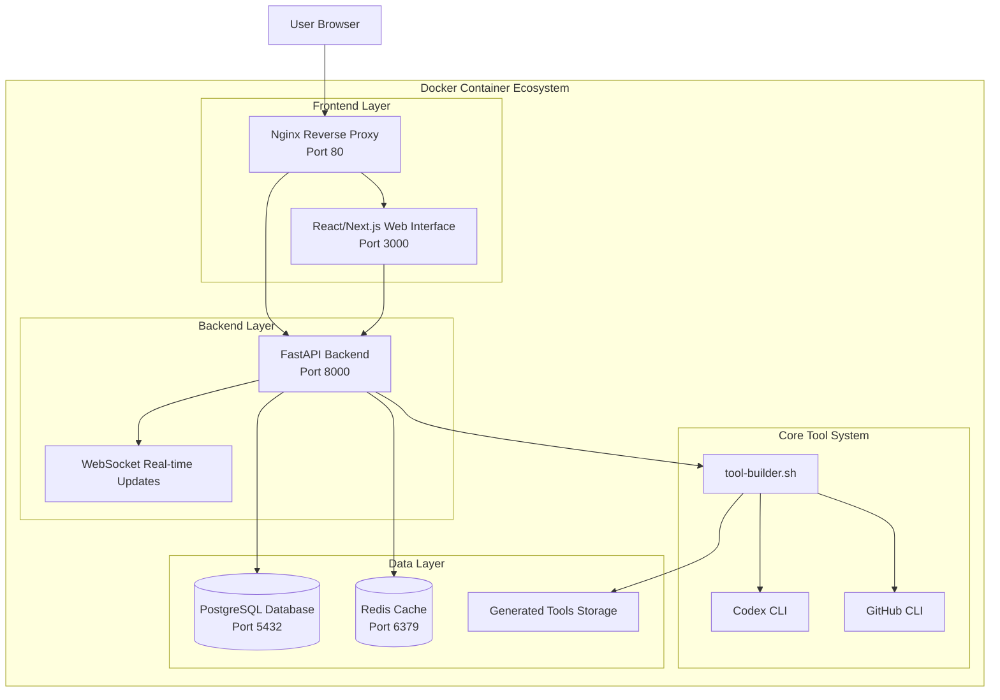

# 🎨 Tool Builder Web UI + Docker System

## 🎯 **What This Adds to Tool-Builder**

Your tool-builder.sh script now has a **beautiful web interface** and **one-command Docker deployment**!

### **Before (CLI Only):**
```bash
~/tool-builder.sh my-tool "description"
# Terminal-only interaction
```

### **After (Web UI + CLI):**
```bash
./launch-tool-builder.sh
# Opens beautiful web interface at http://localhost:3000
# Plus all the CLI functionality still works
```

## 🚀 **Complete System Architecture**



## 🎨 **Web UI Features**

### **1. Visual Tool Creation**
- **Form-based input**: No more terminal commands for basic users
- **Real-time validation**: Instant feedback on tool names and descriptions
- **Quick examples**: One-click templates for common tools
- **Progress tracking**: Visual progress bars during generation

### **2. Tool Management Dashboard**
- **Visual tool gallery**: See all your generated tools at a glance
- **Status indicators**: Real-time status updates with color coding
- **Direct links**: One-click access to GitHub repos and Codespaces
- **Tool deletion**: Clean up old or failed tools

### **3. Real-Time Monitoring**
- **WebSocket updates**: Live progress during tool generation
- **Streaming logs**: See tool-builder.sh output in real-time
- **Error reporting**: Detailed error messages if generation fails
- **Step tracking**: Know exactly which phase is running

### **4. Responsive Design**
- **Mobile-friendly**: Works on phones and tablets
- **Dark/light theme**: Adapts to user preferences
- **Accessibility**: Screen reader compatible
- **Fast loading**: Optimized for performance

## 🐳 **Docker System Benefits**

### **1. One-Command Launch**
```bash
# Everything starts with one command:
./launch-tool-builder.sh

# Automatically:
# ✅ Checks prerequisites
# ✅ Creates environment files
# ✅ Starts all services
# ✅ Opens browser
# ✅ Shows status and management commands
```

### **2. Complete Isolation**
- **No dependency conflicts**: Everything runs in containers
- **Clean environment**: Fresh system every time
- **Easy cleanup**: Remove everything with one command
- **Version consistency**: Same environment everywhere

### **3. Scalable Architecture**
- **Microservices**: Each component can scale independently
- **Load balancing**: Nginx handles traffic distribution
- **Database persistence**: PostgreSQL for reliable data storage
- **Caching layer**: Redis for performance optimization

### **4. Development & Production Ready**
- **Hot reload**: UI updates automatically during development
- **Production builds**: Optimized containers for deployment
- **Health checks**: Automatic service monitoring
- **Log aggregation**: Centralized logging system

## 🎮 **How to Use**

### **Quick Start:**
```bash
# 1. Set up environment (one-time)
./launch-tool-builder.sh
# (Will create .env file and prompt for API keys)

# 2. Add your API keys to .env:
OPENAI_API_KEY=sk-your-key-here
GITHUB_TOKEN=ghp_your-token-here

# 3. Launch the system:
./launch-tool-builder.sh
# Opens http://localhost:3000 automatically
```

### **Create Tools via Web UI:**
1. **Open browser** to http://localhost:3000
2. **Click "Create Tool"** tab
3. **Fill in form:**
   - Tool Name: `my-awesome-tool`
   - Description: `does amazing things with data`
4. **Click "Generate Tool"**
5. **Watch real-time progress** in the UI
6. **Get direct links** to GitHub repo and Codespace

### **Manage Existing Tools:**
1. **Click "My Tools"** tab
2. **See all generated tools** with status indicators
3. **Click GitHub link** to view repository
4. **Click Codespace link** to start development
5. **Delete tools** you no longer need

## 🔧 **System Management**

### **View Logs:**
```bash
docker-compose -f docker-compose.tool-builder.yml logs -f
```

### **Stop System:**
```bash
docker-compose -f docker-compose.tool-builder.yml down
```

### **Restart Services:**
```bash
docker-compose -f docker-compose.tool-builder.yml restart
```

### **Update System:**
```bash
git pull origin main
./launch-tool-builder.sh  # Rebuilds containers automatically
```

## 🌟 **Advantages Over CLI-Only**

### **User Experience:**
- ✅ **Visual feedback**: See progress and status at a glance
- ✅ **Error handling**: Clear error messages with solutions
- ✅ **Accessibility**: Works for non-technical users
- ✅ **Mobile support**: Create tools from your phone
- ✅ **Team sharing**: Send web link to colleagues

### **Operational Benefits:**
- ✅ **Multi-user**: Multiple people can use the system simultaneously
- ✅ **Persistence**: Tool history and status preserved
- ✅ **Monitoring**: Real-time system health and metrics
- ✅ **Scalability**: Easy to deploy to cloud platforms
- ✅ **Integration**: API endpoints for automation

### **Development Workflow:**
- ✅ **Faster iteration**: Visual tools reduce command-line friction
- ✅ **Better debugging**: See logs and errors in real-time
- ✅ **Team collaboration**: Share generated tools via web interface
- ✅ **Learning curve**: Easier for new users to get started

## 🔮 **What This Enables**

### **1. Self-Service Tool Generation**
Non-technical team members can now generate tools without touching the command line.

### **2. Tool Factory Dashboard**
Your organization now has a central hub for all generated tools and their status.

### **3. Integration Ready**
The API endpoints enable integration with other systems, chatbots, and automation tools.

### **4. Cloud Deployment**
The Docker system can be deployed to any cloud platform for team-wide access.

### **5. Monitoring & Analytics**
Track tool generation patterns, success rates, and user behavior.

---

## 🎉 **Summary: CLI Evolution**

You now have **three ways** to use tool-builder:

1. **Original CLI**: `~/tool-builder.sh my-tool "description"`
2. **Web Interface**: http://localhost:3000 (visual, user-friendly)
3. **API Integration**: REST endpoints for automation

**The CLI script is now the engine that powers a complete tool generation platform!** 🚀

This evolution transforms tool-builder from a personal automation script into a **full-featured development platform** that can serve teams, organizations, and even be offered as a service to others.

The Docker containerization makes it incredibly easy to:
- ✅ Share with teammates
- ✅ Deploy to production
- ✅ Maintain consistency across environments
- ✅ Scale as usage grows

**Your tool-builder script just became a SaaS platform!** 🌟