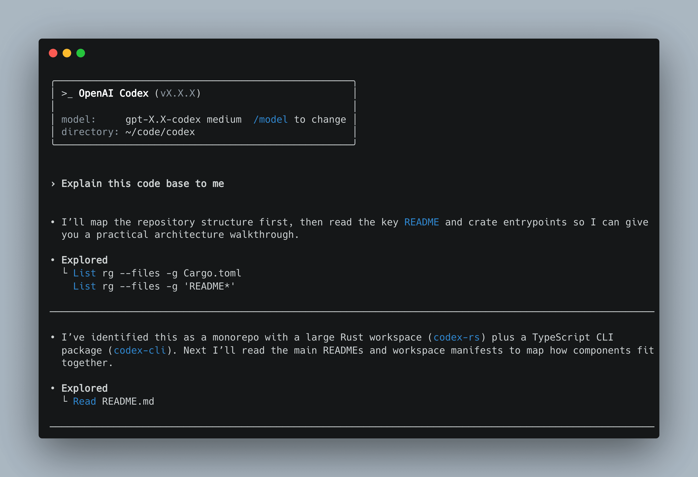
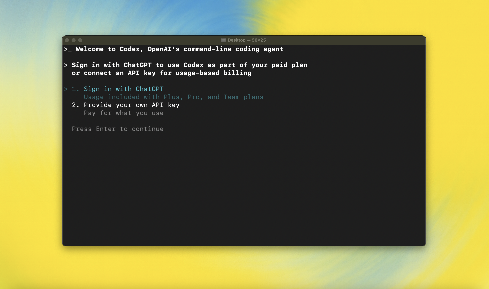

<p align="center">
  <code>npm i -g @ixe1/codexel</code><br />
  <code>brew install --cask Ixe1/tap/codexel</code><br />
  or download from <a href="../../releases/latest">GitHub Releases</a>
</p>

<p align="center">
  <strong>Codexel</strong> is an <strong>unofficial community fork</strong> of
  <a href="https://github.com/openai/codex">OpenAI Codex CLI</a> (a local coding agent).
  <br />
  This repository is community-maintained and is not an official OpenAI project.
  <br /><br />
  IDE extension: <a href="https://developers.openai.com/codex/ide">developers.openai.com/codex/ide</a><br />
  Hosted agent: <a href="https://chatgpt.com/codex">chatgpt.com/codex</a>
</p>

<p align="center">
  
  </p>

---

## What's different in Codexel?

Codexel is a fork of upstream Codex CLI with extra UX and workflow improvements. Recent highlights include:

- Plan Mode: `/plan` with plan approval, plan variants, and automatic execution after approval.
- `ask_user_question`: a tool to ask structured multiple-choice clarifying questions.
- `spawn_subagent`: a read-only parallel research tool surfaced in the TUI (with live activity and token usage).
- TUI improvements for streaming status, tool visibility, and long-running work.
- Isolated state by default in `~/.codexel` (separate from the legacy `~/.codex`).
- Packaging and update-check fixes for Codexel's release channels.

For the full list of Codexel-only changes, see [CHANGELOG.md](./CHANGELOG.md).

---

## Quickstart

### Install

Install globally with your preferred package manager. If you use npm:

```shell
npm install -g @ixe1/codexel
```

Alternatively, if you use Homebrew:

```shell
brew install --cask Ixe1/tap/codexel
```

Then run `codexel`:

```shell
codexel
```

If you're running into upgrade issues with Homebrew, see the [FAQ entry on brew upgrade codexel](./docs/faq.md#brew-upgrade-codexel-isnt-upgrading-me).

<details>
<summary>You can also go to the <a href="../../releases/latest">latest GitHub Release</a> and download the appropriate binary for your platform.</summary>

Each GitHub Release contains many executables, but in practice, you likely want one of these:

- macOS
  - Apple Silicon/arm64: `codexel-aarch64-apple-darwin.tar.gz`
  - x86_64 (older Mac hardware): `codexel-x86_64-apple-darwin.tar.gz`
- Linux
  - x86_64: `codexel-x86_64-unknown-linux-musl.tar.gz`
  - arm64: `codexel-aarch64-unknown-linux-musl.tar.gz`

Each archive contains a single `codexel` binary.

</details>

### Authenticate

<p align="center">
  
  </p>

Run `codexel` and select **Sign in with ChatGPT**, or use an OpenAI API key.
If you're not sure which one to use, start with ChatGPT sign-in and see the
[authentication guide](./docs/authentication.md).

If you previously used a usage-based billing API key with older versions, see the
[migration steps](./docs/authentication.md#migrating-to-chatgpt-login-from-api-key).

### Configure (optional)

Codexel stores preferences in `~/.codexel/config.toml` by default (override with `CODEXEL_HOME`).
For full options, see [Configuration](./docs/config.md).

Common next steps:

- [Sandbox & approvals](./docs/sandbox.md)
- [Execpolicy quickstart](./docs/execpolicy.md)
- [Model Context Protocol (MCP)](./docs/config.md#mcp_servers)

---

## Docs

- [Getting started](./docs/getting-started.md) (usage, tips, `/plan`, session resume)
- [Authentication](./docs/authentication.md)
- [Configuration](./docs/config.md) and [Example config](./docs/example-config.md)
- [Sandbox & approvals](./docs/sandbox.md) (security posture and safe defaults)
- [Execpolicy](./docs/execpolicy.md) (command execution rules)
- [Slash commands](./docs/slash_commands.md) and [Custom prompts](./docs/prompts.md)
- [Non-interactive runs (`codexel exec`)](./docs/exec.md) and [TypeScript SDK](./sdk/typescript/README.md)
- GitHub Action (upstream): https://github.com/openai/codex-action
- [Install & build from source](./docs/install.md)
- [FAQ](./docs/faq.md)

## Releases & support

- Codexel releases: [GitHub Releases](../../releases)
- Codexel-only changes: [CHANGELOG.md](./CHANGELOG.md).
- Upstream release notes: https://github.com/openai/codex/releases

If you hit a bug in Codexel, please open an issue in this repository: [Issues](../../issues).
If you can reproduce the same issue in upstream Codex CLI, linking the upstream report is helpful.

---

## License

This repository is licensed under the [Apache-2.0 License](LICENSE).
