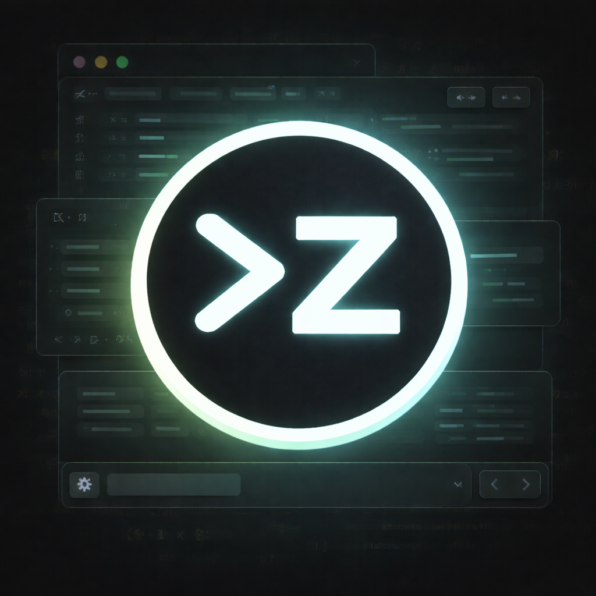

# codez

<p align="center">
  
</p>

このリポジトリをローカルでビルドした Rust 版 Codex を、npm で入れている `codex` と衝突させずに並行運用するためのメモ。

## インストール/更新

リポジトリ直下で実行:

- `./scripts/install-codez.sh`

## バイナリ配布（GitHub Releases）

macOS/Linux 向けに GitHub Releases に prebuilt バイナリ（`codex-<target>.tar.gz`）を載せ、`install.sh` でインストールする想定。

- Release ページ:
  - https://github.com/harukary/codez/releases
- インストール（最新リリース）:
  - `curl -fsSL https://raw.githubusercontent.com/harukary/codez/main/install.sh | sh`
- バージョン指定（タグ）:
  - `CODEZ_VERSION=codez-vX.Y.Z-codez.N sh install.sh`

インストール先はデフォルトで次になる:

- 実体: `~/.local/codez/bin/codex`
- ラッパー: `~/.local/bin/codez`

ラッパーは `--config check_for_update_on_startup=false` を常に付けて起動する（本家 `codex` の挙動に寄せる）。

NOTE: `~/.local/bin` が `PATH` に入っていない環境では `codez` が見つからないので、`~/.zshrc` 等に `export PATH="$HOME/.local/bin:$PATH"` を追加するか、`CODEZ_BIN_DIR` で `PATH` 上のディレクトリを指定する。

WSL（Ubuntu 等）で `codez` が見つからない場合は、まず `echo $PATH` に `~/.local/bin` が入っているか確認し、入っていなければ `~/.bashrc` に `export PATH="$HOME/.local/bin:$PATH"` を追記してシェルを再起動する。`install.sh` は `CODEZ_UPDATE_PATH=1` を指定すると、必要な場合に限り `~/.bashrc`（bash）/`~/.zshrc`（zsh）へ追記する。

## 起動コマンド

- npm 版: `codex`
- ローカルビルド版: `codez`
  - 実体は `~/.local/codez/bin/codex`
  - `~/.local/bin/codez` はラッパーで、起動時に `--config check_for_update_on_startup=false` を付けて「Update available!」の通知を無効化する

## Upstreamとの差分（主なもの）

`upstream/main`（openai/codex）に対する `codez` の差分のうち、運用上影響が大きいもの。

### Upstream マージ履歴

`codez` がどの upstream（openai/codex）に追従しているかを追跡するため、upstream を取り込んだらここに追記する。

| 日付       | upstream                    | マージコミット |
| ---------- | --------------------------- | -------------- |
| 2026-02-03 | rust-v0.94.0                | bdba7852f      |
| 2026-01-26 | rust-v0.89.0（sync PR #30） | c36eb7d6a      |
| 2026-01-24 | rust-v0.89.0                | c49168b89      |
| 2026-01-16 | rust-v0.85.0                | 294e68601      |
| 2026-01-05 | upstream/main               | 3c64f37b4      |
| 2025-12-19 | upstream/main               | 0f1de7557      |
| 2025-12-16 | upstream/main               | 5e2cf28c0      |
| 2025-12-14 | upstream/main               | ad000712d      |

### バージョニング方針

- CLI の表示バージョンは upstream の Rust リリースタグをベースにし、末尾に `-codez.x` を付ける（例: `0.77.0-codez.0`）。
- 「どの upstream に基づくか」を一目で分かるようにするためで、機能差分を示す独自番号は `codez.*` で刻む。
- crates.io には publish しない前提のローカル版想定。

### repo-local `.codex/` 運用

`codez` では「意図しないマージ（notify/MCP/hooks の二重化）を避ける」ため、`config.toml` と `.env` は upstream と読み込み方針が異なる。
（レイヤ順の実装詳細は `codex-rs/core/src/config_loader/README.md` を参照）

このドキュメントでは、`$CODEX_HOME` 配下を **user** と呼ぶ（例: user（`$CODEX_HOME`）/`config.toml`）。

| 対象                  | 置き場所                                                       | 読み込み/優先順位                                                                                                                                                                            | 更新方法                                                                                            | 備考                                                                                                                                                                                                                                                                                                                          |
| --------------------- | -------------------------------------------------------------- | -------------------------------------------------------------------------------------------------------------------------------------------------------------------------------------------- | --------------------------------------------------------------------------------------------------- | ----------------------------------------------------------------------------------------------------------------------------------------------------------------------------------------------------------------------------------------------------------------------------------------------------------------------------- |
| `config.toml`         | `cwd/.codex/config.toml` / user（`$CODEX_HOME`）/`config.toml` | **`cwd/.codex/config.toml` が存在する場合、user（`$CODEX_HOME`）/`config.toml` は読み込まない**（Codez方針）。その上に managed config / CLI overrides が乗る。                               | 手編集                                                                                              | dotenv は `cwd/.codex/.env` があればそれのみ読み込み、無ければ user（`$CODEX_HOME`）/`.env` を読む（dotenv から `CODEX_` は読まない）。                                                                                                                                                                                       |
| `mcp_servers`（MCP）  | `cwd/.codex/config.toml` / user（`$CODEX_HOME`）/`config.toml` | cwd-local `config.toml` がある場合は **global 側が読み込まれない**ため、cwd-local の `mcp_servers` のみが有効。                                                                              | `codex mcp add/remove` は **常に** user（`$CODEX_HOME`）/`config.toml` を更新。cwd-local は手編集。 | `codex mcp` は cwd-local には書かない（`-g/--global` フラグもない）。cwd-local `config.toml` がある場合、`codex mcp add/remove` の変更はその作業ディレクトリでは反映されない。`mcpServerStatus/list` は `cwd` を渡して呼ぶとその `cwd/.codex/config.toml` が反映され、渡さない場合は app-server プロセスの `cwd` 基準になる。 |
| `prompts`             | `repo/.codex/prompts/` / user（`$CODEX_HOME`）/`prompts/`      | `<git root>/.codex/prompts` → user（`$CODEX_HOME`）/`prompts` の順に探索し、同名は repo 側が優先。                                                                                           | 追加/編集/削除（`.md`）                                                                             | `.md` のみ対象。                                                                                                                                                                                                                                                                                                              |
| `skills`              | `repo/.codex/skills/` / user（`$CODEX_HOME`）/`skills/`        | **repo-local からの読み込みに対応済み**。git repo 内では `cwd` から repo root までの間で最初に見つかった `.codex/skills` を優先し、次に user（`$CODEX_HOME`）/`skills`（→ system → admin）。 | 追加/編集/削除（`SKILL.md`）                                                                        | 同名 skill は repo が優先で dedupe。upstream が対応している `.agents/skills` は codez では読み込まない（入口を増やして混乱させないため）。                                                                                                                                                                                    |
| `agents`（subagents） | `<git root>/.codex/agents/` / user（`$CODEX_HOME`）/`agents/`  | `./.codex/config.toml` の `[agents].sources` で探索順を指定（デフォルトは `["repo", "user"]`）。同名は `sources` 順に **先勝ち**。                                                           | 追加/編集/削除（`<name>.md`）                                                                       | skills と違い、subagents は「最寄り `.codex`」探索はしない（repo は `<git root>` 固定）。                                                                                                                                                                                                                                     |

#### `config.toml` / `.env` の upstream との差分（重要）

- upstream（openai/codex）: `$CODEX_HOME/config.toml` を常にレイヤとして読み込み、さらに `cwd` から project root までの間にある複数の `.codex/` を探索して「プロジェクト設定レイヤ」を積む（結果として、親ディレクトリ側の `.codex/` も効きうる）。
- Codez: **起動したディレクトリ直下の `./.codex/config.toml` のみ**をプロジェクト設定として読む（親探索しない）。そして `./.codex/config.toml` が存在する場合は **user（`$CODEX_HOME`）/`config.toml` を読まない**（マージしない）。
  - 目的: notify/MCP/hooks などが「global + project」で混ざって二重登録・二重発火する事故を避ける。
- `.env` も同じ方針:
  - `./.codex/.env` が存在する場合はそれのみ読み込み、user（`$CODEX_HOME`）/`.env` は無視する（`codex-rs/arg0/src/lib.rs` の `load_dotenv()`）。

運用のコツ:

- その作業ディレクトリで **global 設定を有効にしたい**場合は、`./.codex/config.toml` を置かない（または別ディレクトリから起動する）。

#### OpenCode（opencode）設定の生成（MCP）

Codex の `~/.codex/config.toml`（および `~/workspace/.codex/config.toml` が存在する場合はそれ）にある `[mcp_servers]` を元に、OpenCode の設定（JSONC）を生成するスクリプトを用意している。

- user 設定: `~/.config/opencode/opencode.json`
- workspace 設定（任意）: `~/workspace/opencode.json`（`~/workspace/.codex/config.toml` がある場合のみ生成）

実行:

```sh
node scripts/sync-opencode-config.cjs
```

既存ファイルを上書きする場合:

```sh
node scripts/sync-opencode-config.cjs --force
```

#### ツールの有効化（例: AskUserQuestion）

`ask_user_question` はデフォルト無効で、明示的に有効化した場合のみモデルへ露出する。

推奨（canonical）: feature で有効化する:

```toml
[features]
ask_user_question_tool = true
```

互換（legacy）: tools で有効化する（内部的には feature にマップされる）:

```toml
[tools]
ask_user_question = true
```

### subagents

- `@name <prompt>` 形式の指示を解釈してサブエージェント実行を補助（`<git root>/.codex/agents` / user（`$CODEX_HOME`）/`agents` から定義を探索）
- 入力補完の記号: `$` は skills、`@` は agents（subagents）
- `run_subagent` 実行時に **親ターンのキャンセルが伝搬**（Ctrl+C / TurnAborted 等でサブエージェントも止まる）
- VSCode拡張の agents 一覧/候補は、ローカル走査ではなく backend RPC（`agents/list`）から取得する（`[agents].sources` が反映される）

#### `agents` の sources（Codez）

user（`$CODEX_HOME`）側の agents を読みたくない場合は、repo-local `./.codex/config.toml` に明示する。

```toml
[agents]
# repo: <git root>/.codex/agents
# user: $CODEX_HOME/agents
sources = ["repo"] # user 側を無効化
```

### hooks

Codez では `config.toml` に `[[hooks]]` を定義して、内部イベント（例: `turn.end`, `web_search.end`, `tool.exec.begin/end`, `tool.call.begin/end`）に応じて外部コマンドを起動できる。

- 設定場所: `cwd/.codex/config.toml`（存在する場合は user（`$CODEX_HOME`）/`config.toml` は読み込まれないため、hooks も「マージ」されず二重発火しない）
- スクリプト置き場例: `cwd/.codex/hooks/*.py`（音を鳴らす等の確認用サンプルを置ける）
- 特徴: デフォルトは observe-only（失敗はログに出るが、エージェントの実行は止めない）。ただし `blocking = true` を使うと tool 実行をブロックできる（後述）。
- 実行cwd: 可能なら git repo root、無ければセッションの `cwd`

### VSCode拡張（codex-ui-vscode-extension）

ローカル開発では `vscode-extension/package.json` の `version` は上げない（Publish 時のみ更新）。そのため、`vsix:install` でインストールされる拡張の表示バージョン（例: `0.1.16`）と、実際に含まれる機能差分（main の最新）が一致しない場合がある。

- 変更履歴は `vscode-extension/CHANGELOG.md` の `Unreleased` を参照する
- モデル/推論強度の変更はセッション単位で保持され、他セッションには波及しない（共有 `config.toml` への自動書き戻しはしない）

#### Claude Code 互換: tool 実行のブロック（統合hooks）

Claude Code の `PreToolUse` に寄せて、Codez の `[[hooks]]` でもツール呼び出しをブロックできる。

- 対象イベント: 現状は `when = "tool.call.begin"` のみ（ツール実行前）
- 有効化: `blocking = true`
- ブロック方法: hook コマンドが **exit code 2** で終了し、`stderr` に理由を書くと、その tool call は実行されず失敗扱いで返る
  - exit code 0: allow（通常実行）
  - exit code 2: deny（ブロック）
  - それ以外: hook の失敗として warning に出しつつ allow（＝意図しないロックアウトを避ける）
- `include_tool_arguments = true` を付けると、stdin JSON に `tool_input` が含まれる（shell/unified_exec 等の引数を見て判定できる）
- 対象範囲:
  - **Codez が tool として実行するコマンドのみ**（TUI / `codez exec` / VSCode拡張の app-server など）
  - ターミナルで直接叩いたコマンド（例: 自分で `git clean -f` を実行）は hooks の対象外

#### 最小例

```toml
[[hooks]]
id = "log-turn-end"
when = "turn.end"
command = ["python3", ".codex/hooks/log_event.py", ".memo/logs/hooks/turn.end.log"]
timeout_ms = 2000
```

#### フィールド

- `id`（任意）: ログ用の識別子。未指定でも動く。
- `when`（必須）: 1つまたは複数のイベント種別。
  - 例: `when = "tool.call.end"` / `when = ["tool.exec.begin", "tool.exec.end"]`
- `command`（必須）: 起動する外部コマンド（argv配列）。hook の入力JSONは **stdin** に渡される。
- `timeout_ms`（任意）: hook コマンドのタイムアウト（ミリ秒）。
- `blocking`（任意）: `true` の場合、`tool.call.begin` で exit code 2 によりツール実行をブロックできる。
- `matcher`（任意）: イベントに応じてマッチ対象が変わる正規表現（Rust `regex`）。
  - `tool.call.*`: `tool_name`（例: `apply_patch`, `mcp__chrome-devtools__list_pages`, `exec_command`, `unified_exec`）
  - `tool.mcp.*`: MCP tool 名（例: `list_pages`）
  - `tool.exec.*`: 実行ソース（`shell` / `unified_exec` / `user_shell`）
  - それ以外: 現状マッチ対象なし（`matcher` 指定しても絞れない）
- `include_tool_arguments`（任意）: `true` の場合、stdin JSON に `tool_input` を含める（ブロック判定用）。

#### `matcher` の例（種類別にHooksを仕込む）

```toml
# chrome-devtools MCP だけ（tool.call.* で qualified name を絞る）
[[hooks]]
when = ["tool.call.begin", "tool.call.end"]
matcher = "^mcp__chrome-devtools__"
command = ["python3", ".codex/hooks/log_event.py", ".memo/logs/hooks/mcp.chrome.tool-call.log"]

# MCP の list_pages だけ（tool.mcp.* で tool 名を絞る）
[[hooks]]
when = ["tool.mcp.begin", "tool.mcp.end"]
matcher = "^list_pages$"
command = ["python3", ".codex/hooks/log_event.py", ".memo/logs/hooks/mcp.list_pages.log"]

# unified_exec のみ（tool.exec.* で exec 種別を絞る）
[[hooks]]
when = ["tool.exec.begin", "tool.exec.end"]
matcher = "^unified_exec$"
command = ["python3", ".codex/hooks/log_event.py", ".memo/logs/hooks/exec.unified.log"]
```

#### payload（stdin JSON）の見方

最低限、`type`（イベント種別）と `thread_id` / `turn_id` が入る。ツール系は `tool_name` / `call_id` が入る。

- 例: `tool.call.begin` / `tool.call.end`
  - `type`: `"tool.call.begin"` / `"tool.call.end"`
  - `tool_name`: 例 `mcp__chrome-devtools__list_pages`
  - `call_id`: 例 `call_...`

詳細を見たい場合は `dump_payload.py` のように stdin を jsonl で保存して確認する。

#### デバッグ

hooks が発火しているかは `codex_core::hooks` の debug ログで追える。

```sh
RUST_LOG=codex_core::hooks=debug codez exec --json '...'
```

## セッション履歴ナレッジ台帳（試作）

一次情報をセッション履歴（`~/.codex/sessions/**/rollout-*.jsonl`）に限定して、「自分が過去にやったこと」を引き出して再利用する。

- 方針:
  - インデックスは作らない（常に履歴を直接探索する）
  - `codex exec` を複数ワーカーで shard（期間）分割して探索し、JSON出力を統合して台帳候補を作る

### 複数ワーカー（shard探索）で台帳候補を作る

機械抽出だけで決め切らず、複数の `codex exec` ワーカーに shard（期間）を割り当てて探索させ、メイン側で統合・判断する。

- shardワーカー実行（例: 4分割）:
  - `python3 scripts/run_session_ledger_shards.py --since 2025-12-01 --until 2026-01-04 --workers 4 --include-archived --query "ナレッジ台帳に載せるべき運用ルール・反復コマンド・切り分け手順を抽出して。成功/失敗は必ず function_call_output を根拠に。"`
- shard出力の統合（決定はしない）:
  - `python3 scripts/merge_session_ledger_shards.py --in-dir .memo/history-search/shards`
