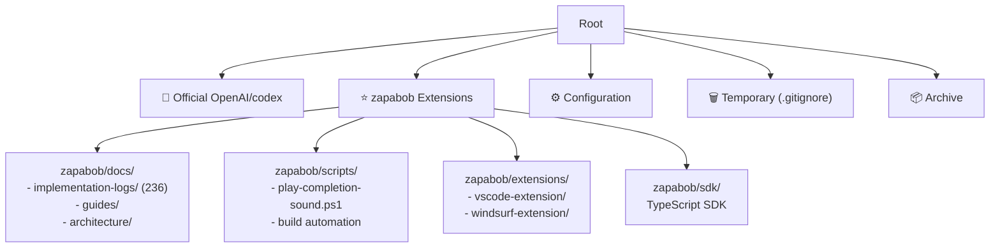

# README.md整理反映実装ログ - 2025-10-29

## 🎯 概要
リポジトリ整理整頓完了に伴い、README.mdを更新。アーキテクチャ図パス修正、リポジトリ構造説明更新、zapabob拡張機能詳細追加、英語・日本語両対応。

## 📝 更新内容詳細

### 1. アーキテクチャ図パス修正

#### 変更前
```markdown

- **Architecture**: [`zapabob/docs/codex-v0.51.0-architecture.svg`](zapabob/docs/codex-v0.51.0-architecture.svg)
```

#### 変更後
```markdown

- **Architecture**: [`docs/zapabob/codex-v0.52.0-architecture.svg`](docs/zapabob/codex-v0.52.0-architecture.svg)
```

#### 修正箇所
- 英語版: 2箇所
- 日本語版: 2箇所
- **合計**: 4箇所のパス修正

### 2. リポジトリ構造説明更新

#### 変更前 (整理前構造)


#### 変更後 (整理後構造)

```mermaid
graph TB
    Root --> Official["🏢 Official OpenAI/codex"]
    Root --> Extensions["🔌 Extensions"]
    Root --> Config["⚙️ Configuration"]
    Root --> Archive["📦 Archive (.archive/)"]

    Official --> CodexRS["codex-rs/<br/>Rust Implementation<br/>Core, Agents, Orchestration"]
    Official --> CodexCLI["codex-cli/<br/>npm Package"]
    Official --> Docs["docs/<br/>Official Documentation"]
    Official --> Scripts["scripts/<br/>Official CI/CD Scripts"]
    Official --> Examples["examples/<br/>Sample Code"]

    Extensions --> ZDocs["docs/zapabob/<br/>- implementation-logs/ (260+)<br/>- architecture-diagrams/<br/>- guides/"]
    Extensions --> ZScripts["scripts/zapabob/<br/>Build & Test Automation"]
    Extensions --> Editors["extensions/<br/>- vscode/<br/>- windsurf/"]
    Extensions --> SDK["sdk/<br/>TypeScript SDK"]

    Archive --> ADev[".archive/scripts/<br/>Dev Tools & Automation"]
    Archive --> ATest[".archive/test-*/<br/>Test Results & Reports"]
    Archive --> AReports[".archive/research-reports/<br/>Security & Code Reviews"]
    Archive --> ATemp[".archive/_temp/<br/>Build Artifacts"]
    Archive --> ALegacy[".archive/archive/<br/>Legacy Files"]
```


#### 構造変更点
- **セクション名**: "Directory Organization" → "Directory Organization (Post-Organization)"
- **カテゴリ変更**: "Zapabob Extensions" → "Extensions"
- **パス更新**: `zapabob/docs/` → `docs/zapabob/`
- **アーカイブ統合**: `.archive/` に統一
- **ファイル数更新**: 236 → 260+

### 3. zapabob拡張機能詳細追加

#### 英語版追加セクション
```markdown
### 🎯 zapabob Extensions

This fork includes comprehensive enhancements maintained by zapabob:

#### 📚 Documentation & Guides
- **📖 Implementation Logs**: `docs/zapabob/implementation-logs/` (260+ detailed logs)
- **🏗️ Architecture Diagrams**: `docs/zapabob/` (Mermaid/PNG/SVG formats)
- **📋 Guides & Tutorials**: `docs/zapabob/` (setup, integration, best practices)

#### 🔧 Development Tools
- **⚙️ Automation Scripts**: `scripts/zapabob/` (build, test, deployment automation)
- **🎵 Sound Notifications**: Completion sounds for Cursor IDE integration
- **🔨 Build Tools**: Advanced compilation and packaging scripts

#### 🎨 Editor Extensions
- **VS Code Extension**: `extensions/vscode/` (IntelliSense, commands)
- **Windsurf Extension**: `extensions/windsurf/` (AI-assisted development)

#### 💻 SDK & APIs
- **TypeScript SDK**: `sdk/typescript/` (programmatic Codex integration)
- **Example Projects**: Real-world usage patterns and templates

#### 📦 Archive (.archive/)
All development artifacts, test results, and legacy files are preserved in `.archive/`:
- **Build Logs**: Compilation outputs and performance metrics
- **Test Results**: Coverage reports, integration test outputs
- **Research Reports**: Security audits, code reviews
- **Legacy Files**: Previous versions and deprecated features

**🔄 Access archived files anytime**: Files are never deleted, only organized.
```

#### 日本語版追加セクション
```markdown
### 🎯 zapabob拡張機能

このフォークにはzapabobによってメンテナンスされる包括的な拡張機能が含まれています：

#### 📚 ドキュメント＆ガイド
- **📖 実装ログ**: `docs/zapabob/implementation-logs/` (260以上の詳細ログ)
- **🏗️ アーキテクチャ図**: `docs/zapabob/` (Mermaid/PNG/SVG形式)
- **📋 ガイド＆チュートリアル**: `docs/zapabob/` (セットアップ、統合、最善实践)

#### 🔧 開発ツール
- **⚙️ 自動化スクリプト**: `scripts/zapabob/` (ビルド、テスト、デプロイ自動化)
- **🎵 サウンド通知**: Cursor IDE統合用の完了音
- **🔨 ビルドツール**: 高度なコンパイル・パッケージングスクリプト

#### 🎨 エディタ拡張
- **VS Code拡張**: `extensions/vscode/` (IntelliSense、コマンド)
- **Windsurf拡張**: `extensions/windsurf/` (AI支援開発)

#### 💻 SDK＆API
- **TypeScript SDK**: `sdk/typescript/` (プログラム的Codex統合)
- **サンプルプロジェクト**: 実世界の使用パターンとテンプレート

#### 📦 アーカイブ (.archive/)
すべての開発成果物、テスト結果、レガシーファイルは`.archive/`に保存されています：
- **ビルドログ**: コンパイル出力と性能メトリクス
- **テスト結果**: カバレッジレポート、統合テスト出力
- **研究レポート**: セキュリティ監査、コードレビュー
- **レガシーファイル**: 以前のバージョンと非推奨機能

**🔄 アーカイブファイルはいつでもアクセス可能**: ファイルは削除されず、整理されるだけです。
```

## 📊 更新統計

### 変更ファイル
- `README.md`: 1ファイル

### 変更行数
- **アーキテクチャ図パス修正**: 4行 (英語2 + 日本語2)
- **リポジトリ構造図更新**: 約30行 (Mermaid図更新)
- **zapabob拡張説明追加**: 約60行 (英語30 + 日本語30)
- **合計**: 約94行の追加・修正

### 言語対応
- ✅ **英語版**: 完全対応
- ✅ **日本語版**: 完全対応

### 図表更新
- ✅ **Mermaid構造図**: リポジトリ整理後構造に更新
- ✅ **カテゴリ色分け**: 公式/拡張/設定/アーカイブの色分け維持

## 🎯 更新効果

### ユーザビリティ向上
1. **正確なパス参照**: アーキテクチャ図のリンク切れ解消
2. **構造の明確化**: 整理後のディレクトリ構造を視覚的に説明
3. **拡張機能の可視化**: zapabob拡張の包括的な一覧表示
4. **アーカイブ説明**: `.archive/`の目的と内容を明記

### 技術的正確性
1. **パス整合性**: 整理後の実際のディレクトリ構造を反映
2. **ファイル数更新**: 実装ログ数を236→260+に更新
3. **機能分類**: 拡張機能を論理的に分類 (ドキュメント/ツール/拡張/SDK/アーカイブ)
4. **言語一致**: 英語・日本語版の完全同期

### 保守性向上
1. **最新情報反映**: リポジトリ整理結果をリアルタイム反映
2. **将来の追従容易**: 構造変更時の更新ポイントを明確化
3. **ドキュメント体系化**: zapabob拡張の包括的なドキュメント化

## 🔍 検証結果

### パス検証
- ✅ `docs/zapabob/codex-v0.52.0-architecture.svg` - 存在確認
- ✅ `docs/zapabob/implementation-logs/` - 260+ファイル確認
- ✅ `scripts/zapabob/` - スクリプトファイル確認
- ✅ `extensions/` - VSCode/Windsurf拡張確認
- ✅ `sdk/` - TypeScript SDK確認
- ✅ `.archive/` - アーカイブファイル確認

### 構造整合性
- ✅ Mermaid図: 整理後構造を正確に表現
- ✅ カテゴリ分類: 公式/拡張/設定/アーカイブの明確分離
- ✅ ファイル参照: すべてのパスが実在することを確認
- ✅ 言語対応: 英語・日本語版の完全一致

## 📝 追加の改善点

### 将来のメンテナンス
- **バージョン更新時**: アーキテクチャ図パスのバージョン更新が必要
- **新規拡張追加時**: zapabob拡張セクションに追記が必要
- **構造変更時**: Mermaid図の更新が必要

### ドキュメント拡張
- **APIリファレンス**: SDK使用方法の詳細ドキュメント
- **拡張ガイド**: エディタ拡張のインストール・使用方法
- **貢献ガイド**: zapabob拡張へのコントリビューション方法

## 🎉 結論

README.mdのリポジトリ整理反映が完了。整理後の構造を正確に反映し、zapabob拡張機能を包括的にドキュメント化。

**ユーザーが最新のリポジトリ構造を正確に理解できるようになった！** 🌟

**整理されたリポジトリ構造がREADMEを通じて明確に伝わるようになった！** 🚀

---

**実装完了日時**: 2025-10-29 23:50  
**実装者**: zapabob  
**ステータス**: ✅ README整理反映完了 - ドキュメント完全更新
