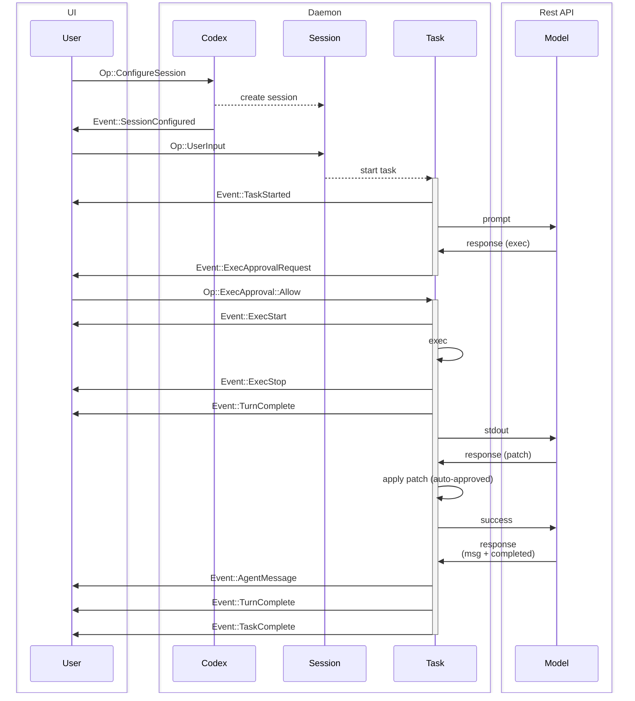
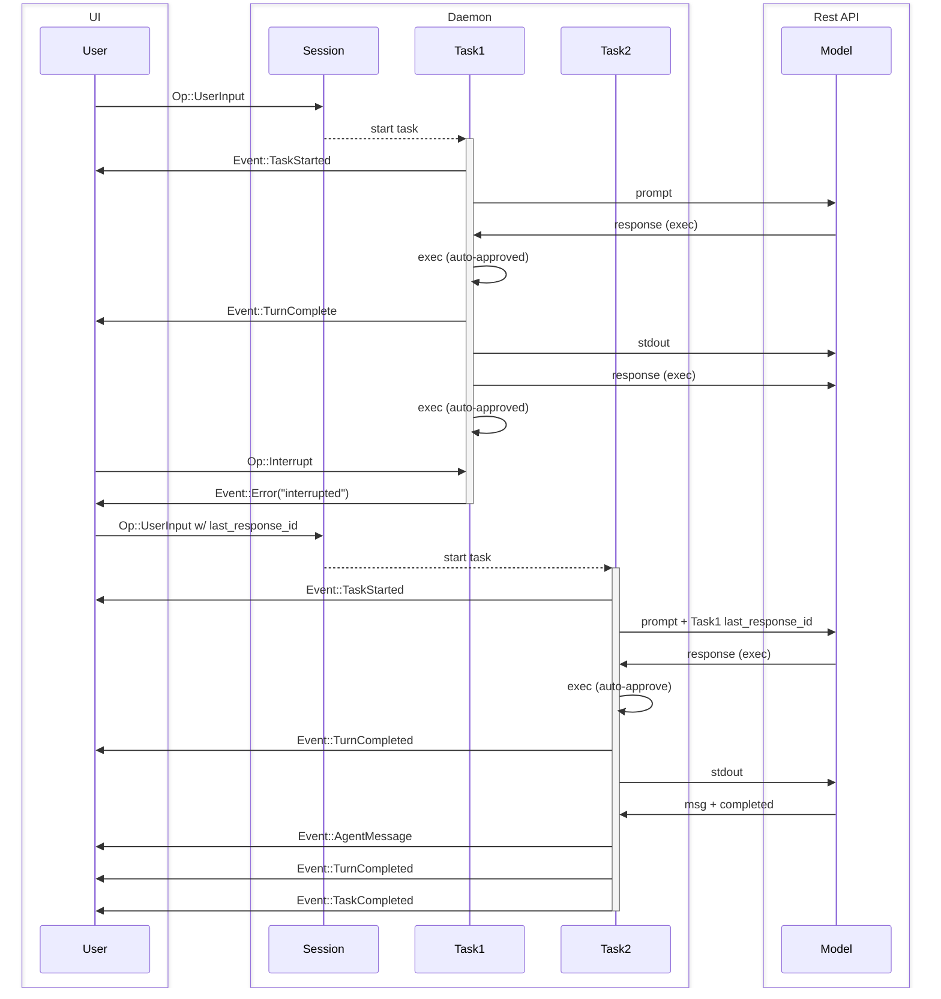
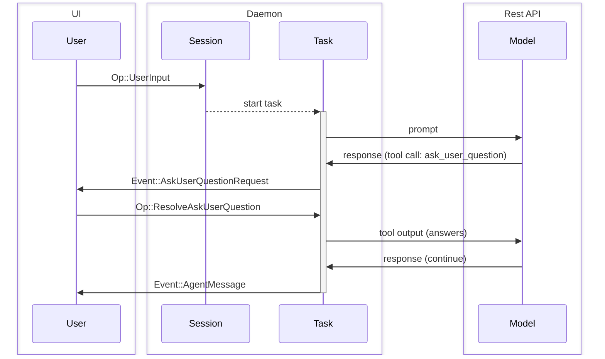
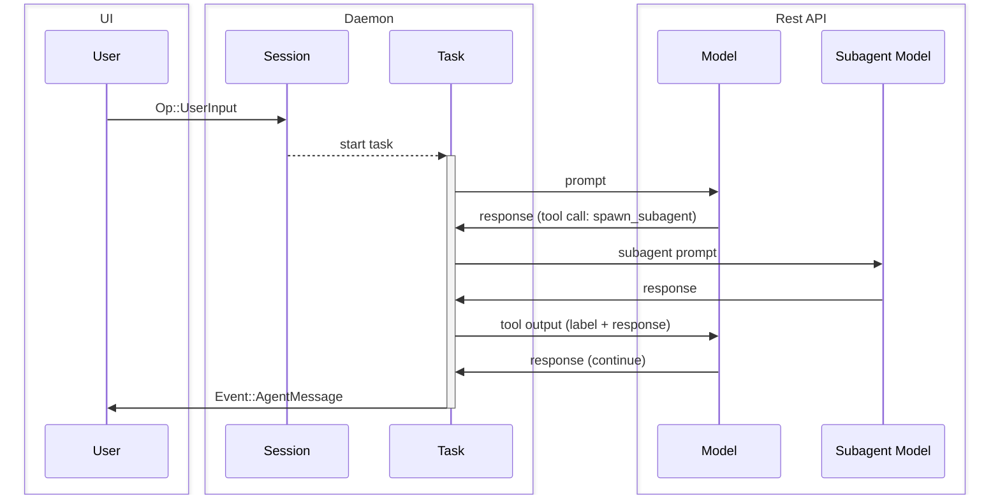
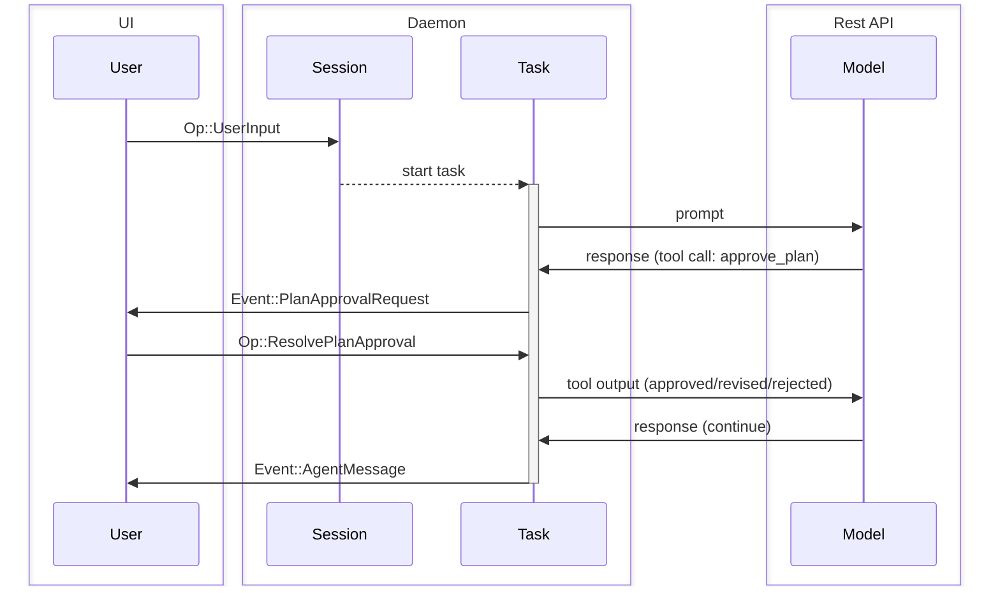
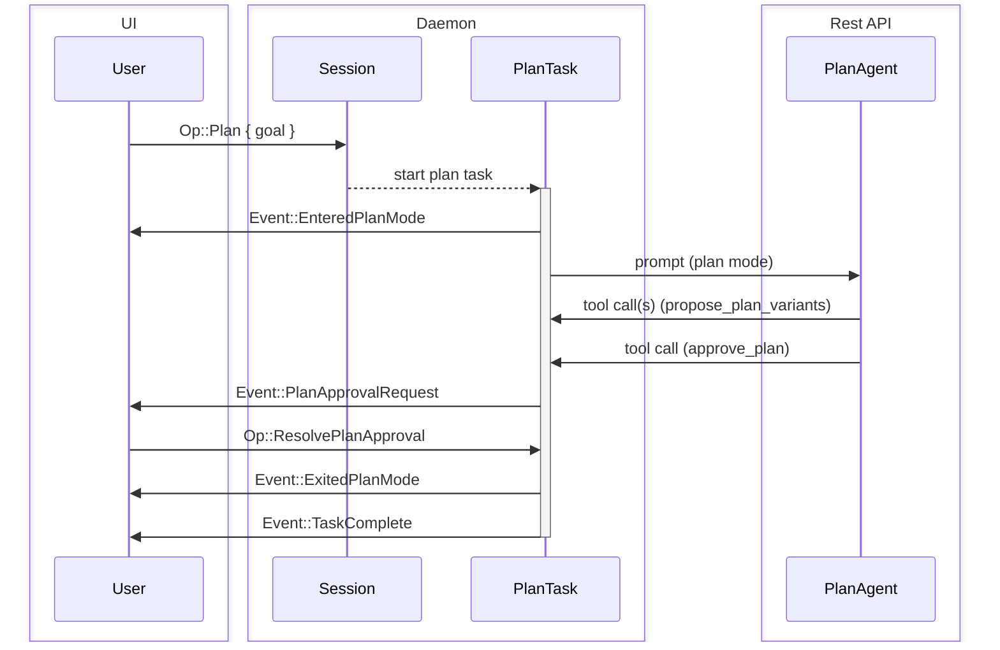

Overview of Protocol Defined in [protocol.rs](../core/src/protocol.rs) and [agent.rs](../core/src/agent.rs).

The goal of this document is to define terminology used in the system and explain the expected behavior of the system.

NOTE: The code might not completely match this spec. There are a few minor changes that need to be made after this spec has been reviewed, which will not alter the existing TUI's functionality.

## Entities

These are entities exit on the codex backend. The intent of this section is to establish vocabulary and construct a shared mental model for the `Codex` core system.

0. `Model`
   - In our case, this is the Responses REST API
1. `Codex`
   - The core engine of codex
   - Runs locally, either in a background thread or separate process
   - Communicated to via a queue pair – SQ (Submission Queue) / EQ (Event Queue)
   - Takes user input, makes requests to the `Model`, executes commands and applies patches.
2. `Session`
   - The `Codex`'s current configuration and state
   - `Codex` starts with no `Session`, and it is initialized by `Op::ConfigureSession`, which should be the first message sent by the UI.
   - The current `Session` can be reconfigured with additional `Op::ConfigureSession` calls.
   - Any running execution is aborted when the session is reconfigured.
3. `Task`
   - A `Task` is `Codex` executing work in response to user input.
   - `Session` has at most one `Task` running at a time.
   - Receiving `Op::UserInput` starts a `Task`
   - Consists of a series of `Turn`s
   - The `Task` executes to until:
     - The `Model` completes the task and there is no output to feed into an additional `Turn`
     - Additional `Op::UserInput` aborts the current task and starts a new one
     - UI interrupts with `Op::Interrupt`
     - Fatal errors are encountered, eg. `Model` connection exceeding retry limits
     - Blocked by user approval (executing a command or patch)
4. `Turn`
   - One cycle of iteration in a `Task`, consists of:
     - A request to the `Model` - (initially) prompt + (optional) `last_response_id`, or (in loop) previous turn output
     - The `Model` streams responses back in an SSE, which are collected until "completed" message and the SSE terminates
     - `Codex` then executes command(s), applies patch(es), and outputs message(s) returned by the `Model`
     - Pauses to request approval when necessary
   - The output of one `Turn` is the input to the next `Turn`
   - A `Turn` yielding no output terminates the `Task`

The term "UI" is used to refer to the application driving `Codex`. This may be the CLI / TUI chat-like interface that users operate, or it may be a GUI interface like a VSCode extension. The UI is external to `Codex`, as `Codex` is intended to be operated by arbitrary UI implementations.

When a `Turn` completes, the `response_id` from the `Model`'s final `response.completed` message is stored in the `Session` state to resume the thread given the next `Op::UserInput`. The `response_id` is also returned in the `EventMsg::TurnComplete` to the UI, which can be used to fork the thread from an earlier point by providing it in the `Op::UserInput`.

Since only 1 `Task` can be run at a time, for parallel tasks it is recommended that a single `Codex` be run for each thread of work.

## Interface

- `Codex`
  - Communicates with UI via a `SQ` (Submission Queue) and `EQ` (Event Queue).
- `Submission`
  - These are messages sent on the `SQ` (UI -> `Codex`)
  - Has an string ID provided by the UI, referred to as `sub_id`
  - `Op` refers to the enum of all possible `Submission` payloads
    - This enum is `non_exhaustive`; variants can be added at future dates
- `Event`
  - These are messages sent on the `EQ` (`Codex` -> UI)
  - Each `Event` has a non-unique ID, matching the `sub_id` from the `Op::UserInput` that started the current task.
  - `EventMsg` refers to the enum of all possible `Event` payloads
    - This enum is `non_exhaustive`; variants can be added at future dates
    - It should be expected that new `EventMsg` variants will be added over time to expose more detailed information about the model's actions.

For complete documentation of the `Op` and `EventMsg` variants, refer to [protocol.rs](../core/src/protocol.rs). Some example payload types:

- `Op`
  - `Op::UserInput` – Any input from the user to kick off a `Task`
  - `Op::Interrupt` – Interrupts a running task
  - `Op::ExecApproval` – Approve or deny code execution
  - `Op::ResolveAskUserQuestion` – Reply to an interactive question prompt
  - `Op::Plan` – Start a planning session (/plan)
  - `Op::ResolvePlanApproval` – Reply to an interactive plan approval prompt
  - `Op::ListSkills` – Request skills for one or more cwd values (optionally `force_reload`)
- `EventMsg`
  - `EventMsg::AgentMessage` – Messages from the `Model`
  - `EventMsg::ExecApprovalRequest` – Request approval from user to execute a command
  - `EventMsg::AskUserQuestionRequest` – Ask the user a multiple-choice question and await an answer
  - `EventMsg::PlanApprovalRequest` – Ask the user to approve / revise / reject a proposed plan
  - `EventMsg::SubAgentToolCallBegin` – Tool call begin event for `spawn_subagent` (description + label + prompt)
  - `EventMsg::SubAgentToolCallEnd` – Tool call end event for `spawn_subagent` (duration + tokens + result)
  - `EventMsg::EnteredPlanMode` – Notify the UI that plan mode started
  - `EventMsg::ExitedPlanMode` – Notify the UI that plan mode ended (optional final plan included)
  - `EventMsg::TaskComplete` – A task completed successfully
  - `EventMsg::Error` – A task stopped with an error
  - `EventMsg::Warning` – A non-fatal warning that the client should surface to the user
  - `EventMsg::TurnComplete` – Contains a `response_id` bookmark for last `response_id` executed by the task. This can be used to continue the task at a later point in time, perhaps with additional user input.
  - `EventMsg::ListSkillsResponse` – Response payload with per-cwd skill entries (`cwd`, `skills`, `errors`)

The `response_id` returned from each task matches the OpenAI `response_id` stored in the API's `/responses` endpoint. It can be stored and used in future `Sessions` to resume threads of work.

## Transport

Can operate over any transport that supports bi-directional streaming. - cross-thread channels - IPC channels - stdin/stdout - TCP - HTTP2 - gRPC

Non-framed transports, such as stdin/stdout and TCP, should use newline-delimited JSON in sending messages.

## Example Flows

Sequence diagram examples of common interactions. In each diagram, some unimportant events may be eliminated for simplicity.

### Basic UI Flow

A single user input, followed by a 2-turn task

### Task Interrupt

Interrupting a task and continuing with additional user input.

### AskUserQuestion (interactive prompt)

Pausing a task to ask the user a question, then resuming after the answer is provided.

### SpawnSubagent (read-only subagent)

Spawning a read-only subagent to answer a focused prompt, then returning its response
as tool output.

### PlanApproval (interactive prompt)

Pausing a task to ask the user to approve a proposed plan, then resuming after the decision is provided.

Notes:
- When the user approves (`Op::ResolvePlanApproval` with `Approved`), the daemon may emit an immediate `Event::BackgroundEvent` and `Event::PlanUpdate` so UIs can show visible progress before the model produces more output.

### Plan Mode (/plan)

Starting a planning session that runs in a dedicated planning context, optionally uses planning subagents for variants, then exits back to the main session.

Notes:
- When a plan is approved, the daemon emits `Event::ExitedPlanMode` with a `PlanOutputEvent` that includes the approved `title`, `summary`, and `plan` (including `explanation` + step list). UIs may render this directly.
- The daemon also records an assistant message summarizing the approved plan (title/summary/explanation/steps) so it appears in normal chat history.
- To make execution robust to conversation-history compaction, the daemon pins the approved plan into the next normal turn's developer instructions (consumed once) for interactive session sources (CLI/VSCode).
- Some clients may automatically start a follow-up normal turn after plan approval to execute the approved plan.

