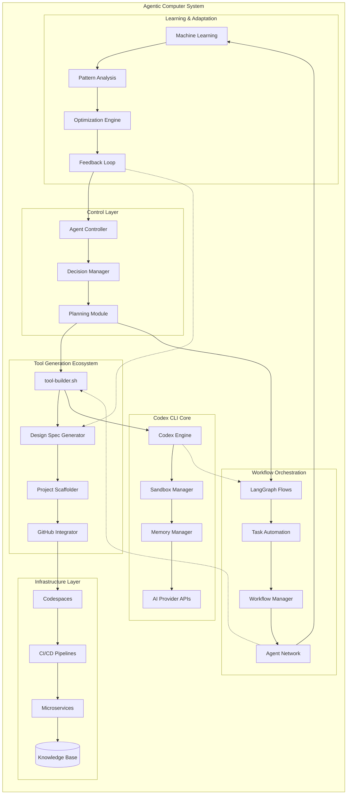
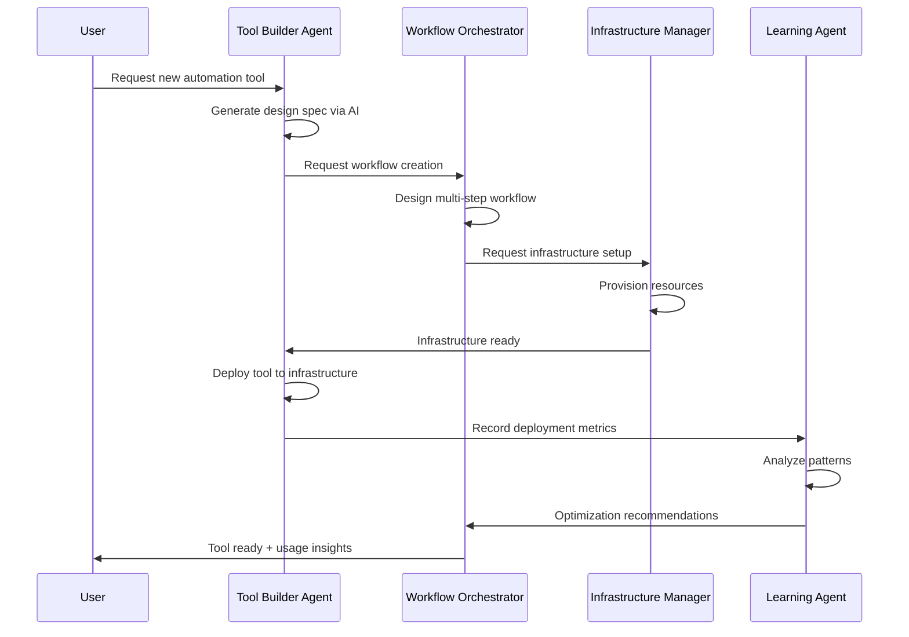
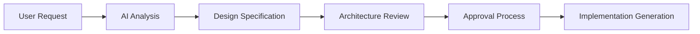
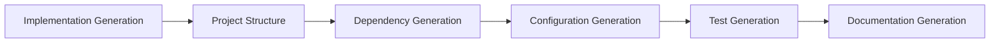
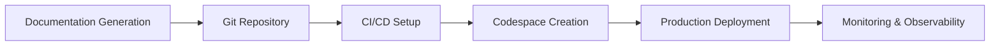
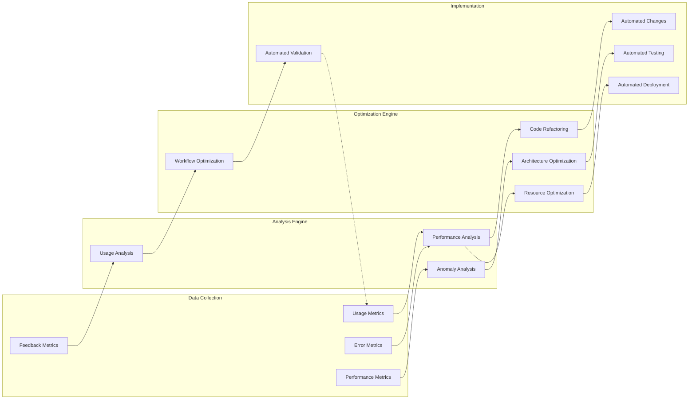
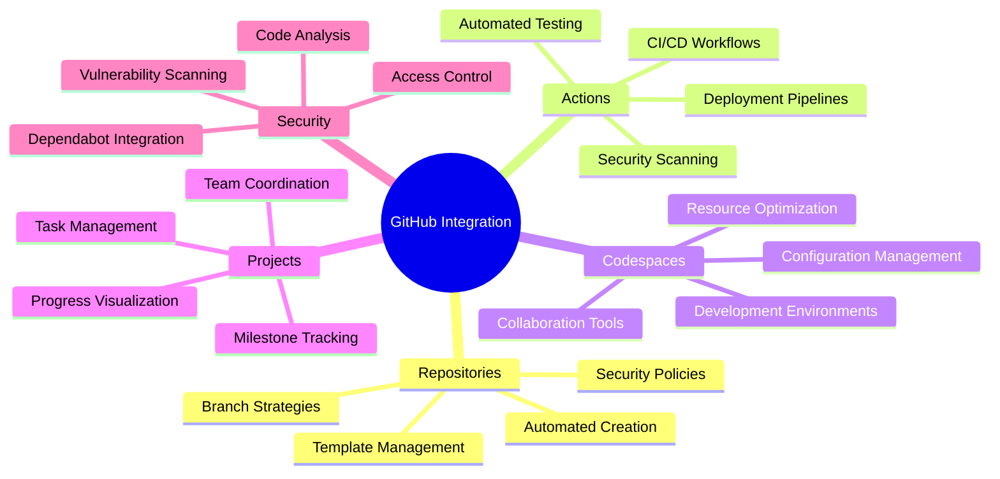
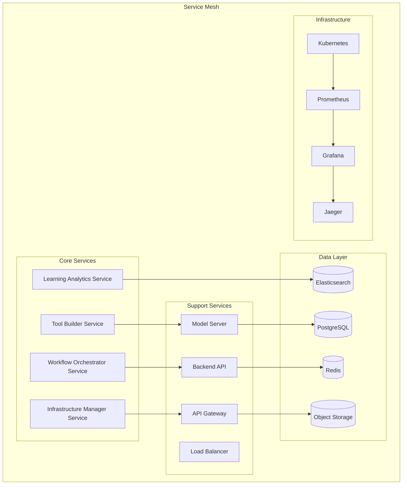
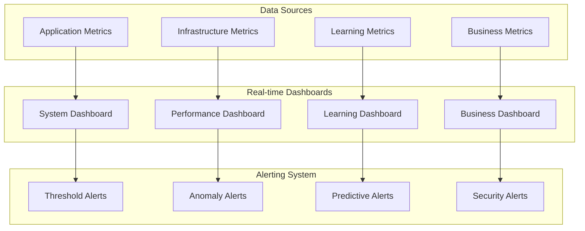
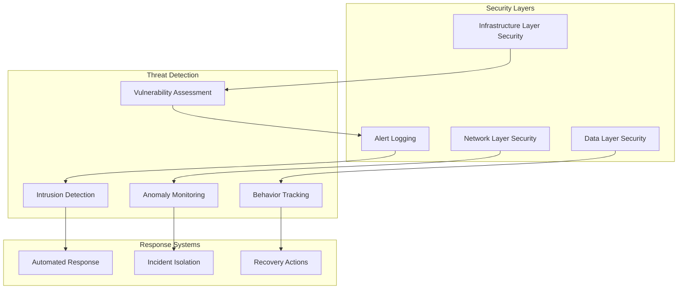

# Agentic Computer System Architecture

**A Comprehensive Guide to Building Autonomous Development Environments**

## 🧠 Introduction to Agentic Computing

An agentic computer system represents the next evolution in autonomous computing - systems that can reason, plan, execute tasks, and continuously improve themselves without human intervention. This architecture document outlines how the Codex CLI ecosystem has been enhanced with the `tool-builder.sh` system to create a self-improving, autonomous development environment.

## 🎯 Core Philosophy

### Systems-Based Software Development (SBSD)

Our approach follows Systems-Based Software Development principles:

- **Holistic System Perspective**: Software as part of larger socio-technical systems
- **Interface-First Design**: Clear component boundaries and contracts
- **Autonomous Operation**: Self-managing and self-improving capabilities
- **Emergent Intelligence**: System-level behavior emerging from component interactions

### Agentic Principles

1. **Autonomy**: Agents operate independently with minimal human oversight
2. **Reactivity**: Respond to environmental changes and events
3. **Proactivity**: Take initiative to achieve goals
4. **Social Ability**: Communicate and collaborate with other agents
5. **Learning**: Continuously improve through experience

## 🏗️ System Architecture Overview



## 🤖 Agent Network Architecture

### Agent Types and Responsibilities

#### 1. Tool Builder Agent

- **Purpose**: Autonomous CLI tool generation and deployment
- **Capabilities**:
  - AI-powered design specification generation
  - Intelligent project scaffolding
  - Automated GitHub repository creation
  - Continuous integration setup
- **Integration**: `tool-builder.sh` + ChatGPT API + GitHub CLI

#### 2. Workflow Orchestrator Agent

- **Purpose**: Multi-step task automation and coordination
- **Capabilities**:
  - LangGraph-based workflow execution
  - Agent task delegation
  - Resource management
  - Error recovery and retry logic
- **Integration**: LangGraph + Codex CLI + Services mesh

#### 3. Infrastructure Manager Agent

- **Purpose**: Autonomous infrastructure provisioning and optimization
- **Capabilities**:
  - Dynamic resource scaling
  - Cost optimization
  - Performance monitoring
  - Security management
- **Integration**: Docker + GitHub Actions + CircleCI + Cloud providers

#### 4. Learning Agent

- **Purpose**: System-wide pattern recognition and optimization
- **Capabilities**:
  - Usage pattern analysis
  - Performance optimization
  - Predictive scaling
  - Automated refactoring
- **Integration**: Machine learning pipelines + Analytics + Feedback systems

### Agent Communication Patterns



## 🔄 Autonomous Tool Generation Lifecycle

### Phase 1: Intelligent Design Generation



**Process Details:**

1. **Natural Language Processing**: Parse user requirements
2. **Context Analysis**: Understand existing system context
3. **Design Pattern Selection**: Choose appropriate architectural patterns
4. **Specification Generation**: Create detailed technical specifications
5. **Validation**: Ensure feasibility and consistency

### Phase 2: Autonomous Scaffolding



**Process Details:**

1. **Directory Structure**: Create optimal project layout
2. **Dependency Management**: Install required libraries and tools
3. **Configuration Files**: Generate environment-specific configs
4. **Test Suite**: Create comprehensive test coverage
5. **Documentation**: Generate user and developer documentation

### Phase 3: Automated Integration



**Process Details:**

1. **Version Control**: Initialize Git repository with proper history
2. **CI/CD Pipelines**: Set up automated testing and deployment
3. **Development Environment**: Configure cloud development spaces
4. **Production Deployment**: Deploy to appropriate environments
5. **Monitoring Setup**: Implement comprehensive observability

## 🧪 Self-Improving System Mechanisms

### Continuous Learning Pipeline



### Adaptive Mechanisms

#### 1. Performance Optimization

- **Dynamic Resource Allocation**: Adjust compute resources based on workload
- **Caching Strategies**: Intelligent caching of frequently used components
- **Load Balancing**: Distribute workload across available resources
- **Predictive Scaling**: Scale infrastructure before demand spikes

#### 2. Code Quality Enhancement

- **Automated Refactoring**: Improve code structure based on usage patterns
- **Test Coverage Optimization**: Generate additional tests for critical paths
- **Security Hardening**: Automatically apply security best practices
- **Dependency Updates**: Keep dependencies current and secure

#### 3. Workflow Optimization

- **Path Analysis**: Identify most efficient execution paths
- **Parallel Execution**: Maximize concurrency where possible
- **Error Recovery**: Implement intelligent retry and fallback mechanisms
- **Resource Utilization**: Optimize resource usage patterns

## 🔧 Integration with Existing Tools

### GitHub Ecosystem Integration



### CircleCI Advanced Integration

**Multi-Pipeline Architecture:**

```yaml
# .circleci/config.yml
version: 2.1

orbs:
  codex: codex/cli@1.0.0
  security: security/scanner@2.0.0

workflows:
  agentic_system:
    jobs:
      - codex/analyze:
          context: agentic-context
      - security/scan:
          requires: [codex/analyze]
      - build_and_test:
          requires: [security/scan]
      - deploy_staging:
          requires: [build_and_test]
          filters:
            branches:
              only: main
      - integration_tests:
          requires: [deploy_staging]
      - deploy_production:
          requires: [integration_tests]
          filters:
            branches:
              only: main
      - performance_analysis:
          requires: [deploy_production]
      - optimization_feedback:
          requires: [performance_analysis]
```

### Docker Microservices Architecture



## 📊 System Observability and Monitoring

### Metrics Collection Strategy

#### Application Metrics

- **Tool Generation Success Rate**: Percentage of successful tool creations
- **Workflow Completion Time**: Average time for workflow execution
- **Error Rate**: System-wide error frequency and types
- **Resource Utilization**: CPU, memory, and storage usage patterns

#### Business Metrics

- **User Engagement**: Tool usage frequency and patterns
- **Productivity Gains**: Time saved through automation
- **Cost Optimization**: Infrastructure cost reductions
- **Quality Improvements**: Code quality metrics and trends

#### Learning Metrics

- **Pattern Recognition Accuracy**: ML model performance metrics
- **Optimization Impact**: Measurable improvements from optimizations
- **Prediction Accuracy**: Forecasting accuracy for resource needs
- **Adaptation Speed**: Time to implement and validate improvements

### Monitoring Dashboard



## 🚀 Future Evolution and Roadmap

### Phase 1: Foundation (Current)

- ✅ Basic tool generation with `tool-builder.sh`
- ✅ Codex CLI integration
- ✅ GitHub ecosystem integration
- ✅ Docker microservices architecture

### Phase 2: Intelligence Enhancement

- 🔄 Advanced AI model integration (GPT-4o, Claude, Gemini)
- 🔄 Sophisticated workflow orchestration with LangGraph
- 🔄 Intelligent resource management
- 🔄 Basic learning and adaptation mechanisms

### Phase 3: Autonomous Operation

- 📋 Self-modifying codebase capabilities
- 📋 Advanced agent collaboration patterns
- 📋 Predictive system behavior
- 📋 Autonomous problem-solving

### Phase 4: Ecosystem Evolution

- 📋 Distributed system architecture
- 📋 Cross-organizational agent networks
- 📋 Market-based resource allocation
- 📋 Emergent behavior research

### Advanced Research Directions

#### 1. Meta-Programming Agents

- **Self-Modifying Code**: Agents that can modify their own source code
- **Evolutionary Programming**: Genetic algorithms for code optimization
- **Neural Architecture Search**: Automated neural network design
- **Program Synthesis**: Automatic generation of programs from specifications

#### 2. Swarm Intelligence

- **Collective Problem Solving**: Multiple agents collaborating on complex tasks
- **Distributed Consensus**: Agreement mechanisms for agent networks
- **Emergent Behavior**: Complex behaviors arising from simple agent interactions
- **Self-Organization**: Spontaneous structure formation in agent networks

#### 3. Cognitive Architecture

- **Memory Systems**: Long-term and working memory for agents
- **Attention Mechanisms**: Focus allocation in complex environments
- **Reasoning Engines**: Logical and probabilistic reasoning capabilities
- **Metacognition**: Agents reasoning about their own reasoning

## 🔐 Security and Safety Considerations

### Security Framework



### AI Safety Measures

1. **Bounded Autonomy**: Strict limits on agent capabilities
2. **Human Oversight**: Critical decision points require human approval
3. **Audit Trails**: Comprehensive logging of all agent actions
4. **Rollback Mechanisms**: Ability to undo agent changes
5. **Ethical Guidelines**: Built-in ethical decision-making frameworks

### Data Protection

- **Encryption**: End-to-end encryption for all sensitive data
- **Access Control**: Role-based access control (RBAC)
- **Data Minimization**: Collect only necessary data
- **Privacy by Design**: Privacy considerations in all system components

## 📚 Documentation and Knowledge Management

### Documentation Strategy

1. **Living Documentation**: Self-updating documentation based on code changes
2. **Interactive Tutorials**: Hands-on learning experiences
3. **Video Guides**: Visual explanations of complex concepts
4. **API Documentation**: Comprehensive API reference with examples

### Knowledge Base Structure

```
docs/
├── architecture/
│   ├── system-overview.md
│   ├── agent-design.md
│   └── integration-patterns.md
├── guides/
│   ├── getting-started.md
│   ├── advanced-usage.md
│   └── troubleshooting.md
├── api/
│   ├── rest-api.md
│   ├── graphql-api.md
│   └── sdk-reference.md
└── examples/
    ├── basic-automation/
    ├── complex-workflows/
    └── enterprise-integration/
```

## 🤝 Community and Ecosystem

### Open Source Strategy

- **Core Open Source**: Basic functionality freely available
- **Commercial Extensions**: Advanced features for enterprise users
- **Community Contributions**: Welcoming external contributions
- **Plugin Ecosystem**: Extensible architecture for third-party plugins

### Developer Experience

- **Easy Onboarding**: Simple setup and configuration
- **Rich Tooling**: Comprehensive development tools
- **Active Community**: Forums, chat, and support channels
- **Regular Updates**: Frequent releases with new features

---

**This architecture represents a vision for the future of software development - where intelligent agents work alongside humans to create, optimize, and maintain software systems autonomously. The integration of tool-builder.sh with the Codex CLI ecosystem is just the beginning of this journey toward truly agentic computing systems.**
