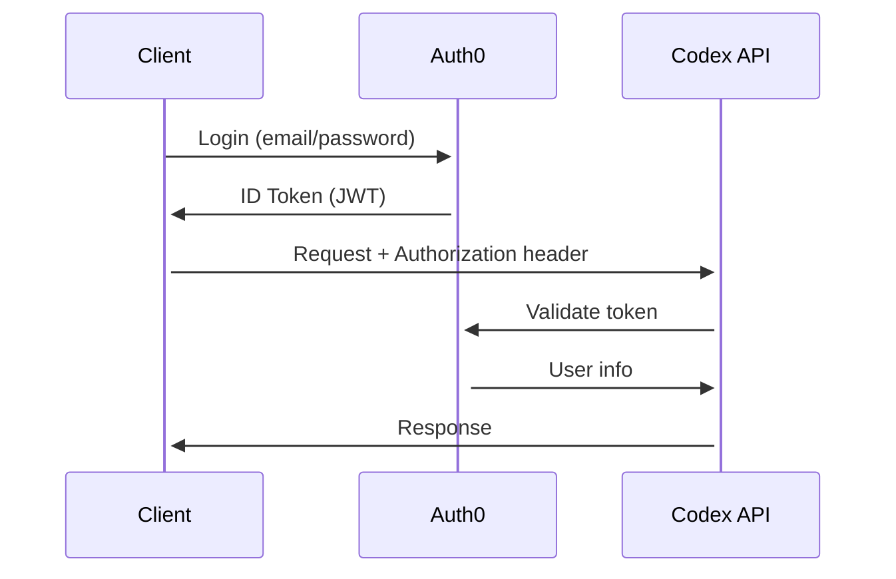

# Codex Cloud API設計書

**バージョン**: v1.0.0  
**最終更新**: 2025年11月2日  
**目的**: Codex Cloud SaaS APIの完全な設計仕様

---

## 📋 目次

1. [アーキテクチャ概要](#architecture)
2. [認証 & 認可](#auth)
3. [エージェント実行](#agents)
4. [可視化エンドポイント](#visualization)
5. [サブスクリプション管理](#subscription)
6. [WebSocket](#websocket)
7. [Rate Limiting](#rate-limiting)
8. [エラーハンドリング](#errors)

---

## <a name="architecture"></a>🏗️ アーキテクチャ概要

### スタック

```
Client (Browser/IDE/CLI)
    ↓ HTTPS/WSS
[ API Gateway - AWS ALB/CloudFlare ]
    ↓
[ Rust Backend - axum ]
    ├── Authentication (JWT + Auth0)
    ├── Agent Orchestrator
    ├── Visualization Service
    └── Subscription Manager
    ↓
[ GPU Cluster - Kubernetes ]
[ PostgreSQL - User data ]
[ Redis - Session/Cache ]
[ S3 - Artifacts ]
```

### Base URL

- **Production**: `https://api.codex.ai`
- **Staging**: `https://api-staging.codex.ai`
- **Development**: `http://localhost:8080`

### API Versioning

```
https://api.codex.ai/v1/{endpoint}
```

### Content Type

```
Content-Type: application/json
Accept: application/json
```

---

## <a name="auth"></a>🔐 認証 & 認可

### 認証フロー



### JWT Structure

```json
{
  "sub": "auth0|507f1f77bcf86cd799439011",
  "email": "user@example.com",
  "email_verified": true,
  "iss": "https://codex.auth0.com/",
  "aud": "https://api.codex.ai",
  "iat": 1699999999,
  "exp": 1700086399,
  "azp": "CLIENT_ID",
  "scope": "openid profile email",
  "codex_tier": "pro",
  "codex_subscription_id": "sub_1ABC..."
}
```

### API Key (Alternative)

For CLI/automation:

```bash
curl -H "X-API-Key: codex_sk_live_..." https://api.codex.ai/v1/agents
```

### Endpoints

#### POST /v1/auth/login

```json
Request:
{
  "email": "user@example.com",
  "password": "secure_password"
}

Response:
{
  "access_token": "eyJhbGciOiJSUzI1NiI...",
  "token_type": "Bearer",
  "expires_in": 86400,
  "refresh_token": "v1.MRrwssK..."
}
```

#### POST /v1/auth/refresh

```json
Request:
{
  "refresh_token": "v1.MRrwssK..."
}

Response:
{
  "access_token": "eyJhbGciOiJSUzI1NiI...",
  "expires_in": 86400
}
```

#### POST /v1/auth/logout

```bash
Authorization: Bearer {access_token}
```

```json
Response:
{
  "success": true,
  "message": "Logged out successfully"
}
```

#### GET /v1/auth/me

Get current user info

```bash
Authorization: Bearer {access_token}
```

```json
Response:
{
  "id": "user_123",
  "email": "user@example.com",
  "name": "John Doe",
  "tier": "pro",
  "subscription": {
    "id": "sub_1ABC...",
    "status": "active",
    "current_period_end": "2025-12-02T00:00:00Z",
    "cancel_at_period_end": false
  },
  "usage": {
    "requests_this_month": 5234,
    "requests_limit": 10000,
    "storage_used_bytes": 4294967296,
    "storage_limit_bytes": 10737418240
  },
  "created_at": "2025-01-15T10:30:00Z"
}
```

---

## <a name="agents"></a>🤖 エージェント実行

### POST /v1/agents/execute

Run AI agent task

```bash
Authorization: Bearer {access_token}
Content-Type: application/json
```

```json
Request:
{
  "task": "Review this code for security vulnerabilities",
  "context": {
    "files": [
      {
        "path": "src/auth.rs",
        "content": "fn authenticate(password: &str) { ... }"
      }
    ],
    "repository": "https://github.com/user/repo",
    "branch": "main"
  },
  "agent_type": "security_expert",
  "max_tokens": 4000,
  "temperature": 0.7
}

Response (202 Accepted):
{
  "task_id": "task_1ABC2DEF3GHI",
  "status": "queued",
  "estimated_duration_seconds": 45,
  "result_url": "/v1/agents/tasks/task_1ABC2DEF3GHI",
  "websocket_url": "wss://api.codex.ai/v1/agents/tasks/task_1ABC2DEF3GHI/stream"
}
```

### GET /v1/agents/tasks/{task_id}

Get task status/result

```bash
Authorization: Bearer {access_token}
```

```json
Response:
{
  "task_id": "task_1ABC2DEF3GHI",
  "status": "completed",
  "progress": 100,
  "created_at": "2025-11-02T10:00:00Z",
  "started_at": "2025-11-02T10:00:05Z",
  "completed_at": "2025-11-02T10:00:50Z",
  "duration_seconds": 45,
  "result": {
    "findings": [
      {
        "severity": "high",
        "title": "SQL Injection vulnerability",
        "description": "User input not sanitized in query",
        "file": "src/db.rs",
        "line": 42,
        "suggestion": "Use parameterized queries"
      }
    ],
    "summary": "Found 3 high, 5 medium, 2 low severity issues"
  },
  "tokens_used": {
    "prompt": 1234,
    "completion": 567,
    "total": 1801
  },
  "cost_usd": 0.0234
}
```

### POST /v1/agents/orchestrate

Multi-agent orchestration

```json
Request:
{
  "goal": "Implement user authentication with JWT, write tests, and security review",
  "strategy": "parallel",
  "agents": ["code_expert", "test_gen", "security_expert"],
  "context": {
    "language": "rust",
    "framework": "axum"
  }
}

Response:
{
  "orchestration_id": "orch_ABC123",
  "status": "in_progress",
  "agents_running": 3,
  "estimated_completion": "2025-11-02T10:15:00Z",
  "result_url": "/v1/agents/orchestrations/orch_ABC123"
}
```

### GET /v1/agents/orchestrations/{orchestration_id}

```json
Response:
{
  "orchestration_id": "orch_ABC123",
  "status": "completed",
  "strategy": "parallel",
  "agents": [
    {
      "agent_type": "code_expert",
      "task_id": "task_1ABC",
      "status": "completed",
      "duration_seconds": 120
    },
    {
      "agent_type": "test_gen",
      "task_id": "task_2DEF",
      "status": "completed",
      "duration_seconds": 90
    },
    {
      "agent_type": "security_expert",
      "task_id": "task_3GHI",
      "status": "completed",
      "duration_seconds": 45
    }
  ],
  "aggregated_result": {
    "files_modified": 5,
    "tests_generated": 15,
    "security_issues": 2,
    "summary": "Successfully implemented authentication with full test coverage"
  },
  "total_duration_seconds": 120,
  "total_tokens_used": 12345
}
```

### DELETE /v1/agents/tasks/{task_id}

Cancel running task

```bash
Authorization: Bearer {access_token}
```

```json
Response:
{
  "success": true,
  "task_id": "task_1ABC2DEF3GHI",
  "status": "cancelled"
}
```

---

## <a name="visualization"></a>🌟 可視化エンドポイント

### POST /v1/visualize/repository

Generate 3D/4D visualization

```json
Request:
{
  "repository_url": "https://github.com/user/repo",
  "branch": "main",
  "analysis_depth": "full",
  "options": {
    "include_commits": true,
    "include_branches": true,
    "include_contributors": true,
    "max_commits": 50000
  }
}

Response (202 Accepted):
{
  "visualization_id": "viz_XYZ789",
  "status": "processing",
  "estimated_duration_seconds": 300,
  "result_url": "/v1/visualize/viz_XYZ789",
  "preview_url": "https://viz.codex.ai/XYZ789"
}
```

### GET /v1/visualize/{visualization_id}

```json
Response:
{
  "visualization_id": "viz_XYZ789",
  "status": "completed",
  "repository": "https://github.com/user/repo",
  "created_at": "2025-11-02T10:00:00Z",
  "completed_at": "2025-11-02T10:05:00Z",
  "stats": {
    "total_commits": 15234,
    "total_files": 1234,
    "total_contributors": 42,
    "lines_of_code": 456789,
    "languages": {
      "Rust": 65.4,
      "TypeScript": 25.2,
      "Python": 9.4
    }
  },
  "data": {
    "nodes": [...],
    "edges": [...],
    "timeline": [...]
  },
  "share_url": "https://viz.codex.ai/XYZ789",
  "embed_code": "<iframe src=\"https://viz.codex.ai/embed/XYZ789\"></iframe>"
}
```

### GET /v1/visualize/{visualization_id}/commits

Get commits data for visualization

```bash
Query Parameters:
  - from: ISO 8601 date (optional)
  - to: ISO 8601 date (optional)
  - author: email filter (optional)
  - branch: branch name (optional)
  - limit: max results (default: 1000, max: 10000)
  - offset: pagination (default: 0)
```

```json
Response:
{
  "visualization_id": "viz_XYZ789",
  "commits": [
    {
      "sha": "a1b2c3d4e5f6...",
      "author": "john@example.com",
      "message": "feat: Add authentication",
      "timestamp": "2025-11-01T15:30:00Z",
      "files_changed": 5,
      "insertions": 234,
      "deletions": 12,
      "branch": "main"
    }
  ],
  "total": 15234,
  "limit": 1000,
  "offset": 0,
  "has_more": true
}
```

### POST /v1/visualize/{visualization_id}/comment

Add comment to commit

```json
Request:
{
  "commit_sha": "a1b2c3d4e5f6...",
  "content": "This commit introduces a security issue",
  "author": "reviewer@example.com"
}

Response:
{
  "comment_id": "cmt_ABC123",
  "visualization_id": "viz_XYZ789",
  "commit_sha": "a1b2c3d4e5f6...",
  "content": "This commit introduces a security issue",
  "author": "reviewer@example.com",
  "created_at": "2025-11-02T10:30:00Z"
}
```

### POST /v1/visualize/{visualization_id}/share

Create share link

```json
Request:
{
  "permissions": "read",
  "expires_in_days": 7
}

Response:
{
  "share_id": "shr_DEF456",
  "url": "https://viz.codex.ai/share/shr_DEF456",
  "expires_at": "2025-11-09T10:30:00Z",
  "permissions": "read"
}
```

---

## <a name="subscription"></a>💳 サブスクリプション管理

### GET /v1/subscription

Get current subscription

```bash
Authorization: Bearer {access_token}
```

```json
Response:
{
  "subscription_id": "sub_1ABC...",
  "tier": "pro",
  "status": "active",
  "billing_cycle": "monthly",
  "amount": 15.00,
  "currency": "usd",
  "current_period_start": "2025-11-01T00:00:00Z",
  "current_period_end": "2025-12-01T00:00:00Z",
  "cancel_at_period_end": false,
  "usage": {
    "requests_this_month": 5234,
    "requests_limit": 10000,
    "storage_used_bytes": 4294967296,
    "storage_limit_bytes": 10737418240,
    "parallel_agents_limit": 10
  },
  "payment_method": {
    "type": "card",
    "last4": "4242",
    "brand": "visa",
    "exp_month": 12,
    "exp_year": 2025
  }
}
```

### POST /v1/subscription/upgrade

Upgrade subscription tier

```json
Request:
{
  "new_tier": "team",
  "billing_cycle": "monthly"
}

Response:
{
  "subscription_id": "sub_2DEF...",
  "tier": "team",
  "status": "active",
  "amount": 50.00,
  "proration_amount": 35.00,
  "message": "Subscription upgraded successfully",
  "effective_date": "2025-11-02T10:30:00Z"
}
```

### POST /v1/subscription/cancel

Cancel subscription

```json
Request:
{
  "cancel_at_period_end": true,
  "reason": "Switching to Pro Desktop",
  "feedback": "Great product, but prefer one-time purchase"
}

Response:
{
  "subscription_id": "sub_1ABC...",
  "status": "active",
  "cancel_at_period_end": true,
  "cancels_at": "2025-12-01T00:00:00Z",
  "message": "Subscription will be cancelled at the end of the current billing period"
}
```

### POST /v1/subscription/reactivate

Reactivate cancelled subscription

```json
Response:
{
  "subscription_id": "sub_1ABC...",
  "status": "active",
  "cancel_at_period_end": false,
  "message": "Subscription reactivated successfully"
}
```

---

## <a name="websocket"></a>🔌 WebSocket

Real-time task progress updates

### Connection

```javascript
const ws = new WebSocket('wss://api.codex.ai/v1/agents/tasks/task_1ABC2DEF3GHI/stream?token=<access_token>');

ws.onopen = () => {
  console.log('Connected');
};

ws.onmessage = (event) => {
  const data = JSON.parse(event.data);
  console.log('Progress:', data);
};
```

### Message Format

```json
// Progress update
{
  "type": "progress",
  "task_id": "task_1ABC2DEF3GHI",
  "progress": 45,
  "message": "Analyzing code...",
  "timestamp": "2025-11-02T10:00:25Z"
}

// Result
{
  "type": "result",
  "task_id": "task_1ABC2DEF3GHI",
  "status": "completed",
  "result": {...},
  "timestamp": "2025-11-02T10:00:50Z"
}

// Error
{
  "type": "error",
  "task_id": "task_1ABC2DEF3GHI",
  "error": {
    "code": "AGENT_TIMEOUT",
    "message": "Task exceeded maximum duration"
  },
  "timestamp": "2025-11-02T10:05:00Z"
}
```

---

## <a name="rate-limiting"></a>⏱️ Rate Limiting

### Limits by Tier

| Tier | Requests/month | Requests/minute | Parallel agents | Storage |
|------|---------------|-----------------|-----------------|---------|
| Free | 100 | 5 | 1 | 1GB |
| Pro | 10,000 | 100 | 10 | 10GB |
| Team | 100,000 | 1,000 | 50 | 100GB |
| Enterprise | Unlimited | Custom | Unlimited | Custom |

### Headers

```
X-RateLimit-Limit: 100
X-RateLimit-Remaining: 95
X-RateLimit-Reset: 1699999999
X-RateLimit-Tier: pro
```

### Rate Limit Response

```json
HTTP 429 Too Many Requests
{
  "error": {
    "code": "RATE_LIMIT_EXCEEDED",
    "message": "Rate limit exceeded. Try again in 42 seconds.",
    "retry_after": 42,
    "tier": "pro",
    "limit": 100,
    "reset_at": "2025-11-02T11:00:00Z"
  }
}
```

---

## <a name="errors"></a>❌ エラーハンドリング

### Error Response Format

```json
{
  "error": {
    "code": "ERROR_CODE",
    "message": "Human-readable error message",
    "details": {...},
    "request_id": "req_ABC123",
    "documentation_url": "https://docs.codex.ai/errors/ERROR_CODE"
  }
}
```

### Error Codes

| Code | HTTP Status | Description |
|------|------------|-------------|
| `UNAUTHORIZED` | 401 | Invalid or missing authentication |
| `FORBIDDEN` | 403 | Insufficient permissions |
| `NOT_FOUND` | 404 | Resource not found |
| `RATE_LIMIT_EXCEEDED` | 429 | Too many requests |
| `INVALID_REQUEST` | 400 | Malformed request |
| `TASK_TIMEOUT` | 408 | Task exceeded time limit |
| `AGENT_ERROR` | 500 | Agent execution failed |
| `INSUFFICIENT_CREDITS` | 402 | Usage limit reached |
| `SERVER_ERROR` | 500 | Internal server error |

### Example Errors

#### Invalid Request

```json
HTTP 400 Bad Request
{
  "error": {
    "code": "INVALID_REQUEST",
    "message": "Missing required field: task",
    "details": {
      "field": "task",
      "reason": "required"
    },
    "request_id": "req_ABC123"
  }
}
```

#### Unauthorized

```json
HTTP 401 Unauthorized
{
  "error": {
    "code": "UNAUTHORIZED",
    "message": "Invalid or expired token",
    "request_id": "req_DEF456"
  }
}
```

#### Insufficient Credits

```json
HTTP 402 Payment Required
{
  "error": {
    "code": "INSUFFICIENT_CREDITS",
    "message": "Monthly request limit reached. Upgrade to continue.",
    "details": {
      "current_tier": "free",
      "requests_used": 100,
      "requests_limit": 100,
      "upgrade_url": "https://codex.ai/pricing"
    },
    "request_id": "req_GHI789"
  }
}
```

---

## 📊 実装優先順位

### Phase 1 (Week 1-2)
- [x] 認証エンドポイント
- [ ] エージェント実行基本API
- [ ] サブスクリプション取得

### Phase 2 (Week 3-4)
- [ ] WebSocket リアルタイム通信
- [ ] 可視化基本エンドポイント
- [ ] Rate limiting実装

### Phase 3 (Week 5-6)
- [ ] マルチエージェントオーケストレーション
- [ ] 可視化高度機能（コメント、共有）
- [ ] 管理ダッシュボード

---

## 🧪 テスト

### Postman Collection

```bash
# Import Postman collection
curl https://docs.codex.ai/postman/collection.json -o codex-api.json
```

### cURL Examples

```bash
# Login
curl -X POST https://api.codex.ai/v1/auth/login \
  -H "Content-Type: application/json" \
  -d '{"email":"user@example.com","password":"password"}'

# Execute agent
curl -X POST https://api.codex.ai/v1/agents/execute \
  -H "Authorization: Bearer <token>" \
  -H "Content-Type: application/json" \
  -d '{"task":"Review code","agent_type":"code_expert"}'

# Get task result
curl https://api.codex.ai/v1/agents/tasks/task_ABC123 \
  -H "Authorization: Bearer <token>"
```

---

**次のステップ**: AWS GPU クラスター見積もり → Discord コミュニティ立ち上げ


