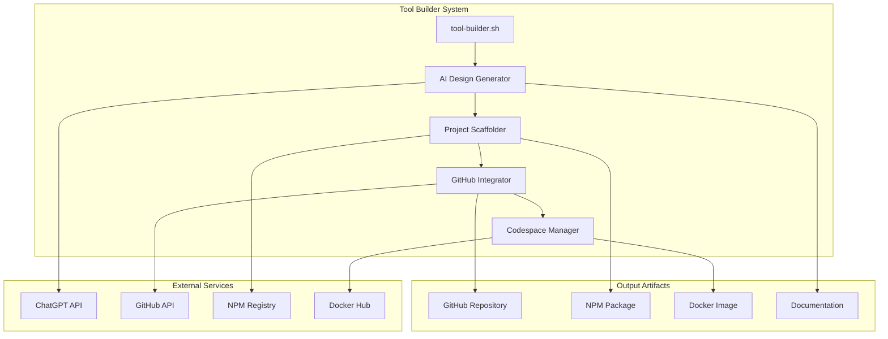
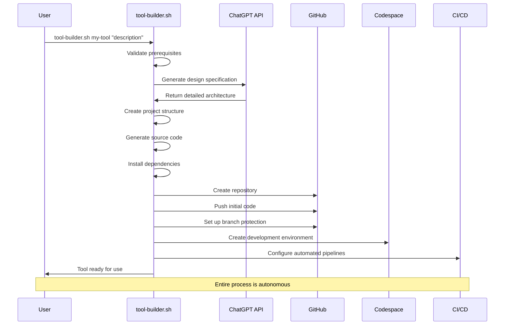
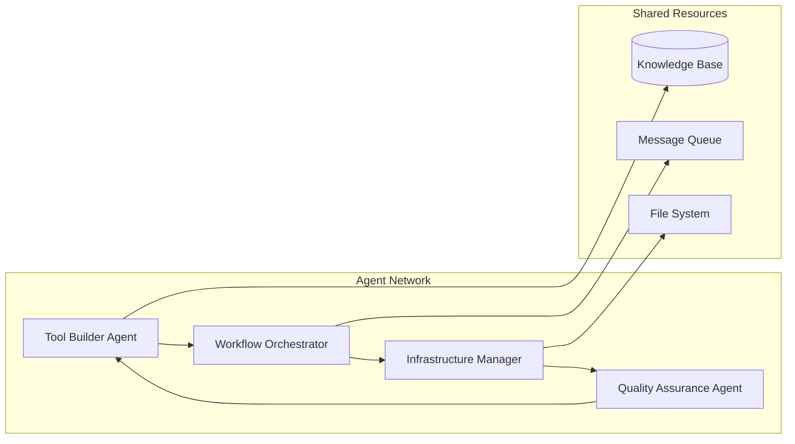

# Tool Builder System Guide

**Autonomous CLI Tool Generation and Deployment**

## 🎯 Overview

The Tool Builder system (`tool-builder.sh`) is an autonomous agent that generates, scaffolds, and deploys CLI tools using AI-powered design specifications. It integrates seamlessly with the Codex CLI ecosystem to create a fully automated development pipeline.

## 🚀 Quick Start

### Prerequisites

- OpenAI API Key
- GitHub CLI (`gh`) authenticated
- Codex CLI installed (`@openai/codex`)
- Node.js 18+ or compatible runtime

### Basic Usage

```bash
# Generate a simple automation tool
~/tool-builder.sh todo-manager "manages todo lists with priorities and due dates"

# Generate a complex data processing tool
~/tool-builder.sh data-pipeline "processes CSV files and generates analytics reports"

# Generate a DevOps utility
~/tool-builder.sh deploy-helper "automates application deployment across environments"
```

## 🏗️ Architecture

### Component Overview



### Execution Flow



## 🛠️ Detailed Process Breakdown

### 1. Prerequisites Validation (Step 0/8)

**What it checks:**

- `codex` - Codex CLI availability
- `gh` - GitHub CLI authentication
- `curl` - HTTP client for API calls
- `jq` - JSON processor for API responses
- `git` - Version control system
- `OPENAI_API_KEY` - API access token

**Error Handling:**

```bash
# Automatic resolution attempts
if ! command -v codex &>/dev/null; then
    echo "Installing Codex CLI..."
    npm install -g @openai/codex
fi

if ! gh auth status &>/dev/null; then
    echo "Please authenticate with GitHub:"
    gh auth login
fi
```

### 2. AI-Powered Design Generation (Step 1/8)

**Process:**

```bash
# Generate comprehensive design specification
DESIGN_PROMPT="You are an expert CLI tool designer. Create a structured design for '${TOOL_NAME}' that ${DESCRIPTION}. Include:
1) Purpose & overview
2) Feature list with priorities
3) Technical architecture
4) Example usage scenarios
5) File/directory structure
6) Testing strategy
7) Documentation plan
8) Deployment approach"

# Call ChatGPT API with advanced prompting
curl -s https://api.openai.com/v1/chat/completions \
  -H "Authorization: Bearer ${OPENAI_API_KEY}" \
  -H "Content-Type: application/json" \
  -d "$(jq -nc --arg model 'gpt-4o' --arg prompt "${DESIGN_PROMPT}" '{
    model: $model,
    messages: [{role: "user", content: $prompt}],
    temperature: 0.3,
    max_tokens: 4000
  }')" | jq -r .choices[0].message.content > design.md
```

**Generated Design Includes:**

- **Architecture Decisions**: Technology stack, design patterns
- **Feature Specifications**: Detailed functionality descriptions
- **File Structure**: Optimal project organization
- **Testing Strategy**: Unit, integration, and E2E testing approaches
- **Documentation Plan**: User guides, API docs, examples

### 3. Intelligent Project Scaffolding (Step 2/8)

**Smart Scaffolding Process:**

```bash
# Create project directory and initialize Git
mkdir -p "${TOOL_NAME}" && cd "${TOOL_NAME}"
git init --initial-branch=main

# Use Codex CLI for intelligent scaffolding
codex --approval-mode full-auto --project-doc ../design.md \
  "Generate a complete CLI project structure for '${TOOL_NAME}' following the design specification. Include:
  - Modern TypeScript/Node.js setup
  - Comprehensive CLI argument parsing
  - Robust error handling
  - Unit and integration tests
  - Documentation and examples
  - CI/CD configuration
  - Docker support"
```

**Generated Project Structure:**

```
my-tool/
├── src/
│   ├── index.ts              # Main entry point
│   ├── cli.ts                # CLI interface
│   ├── commands/             # Command implementations
│   ├── utils/                # Utility functions
│   └── types/                # TypeScript definitions
├── tests/
│   ├── unit/                 # Unit tests
│   ├── integration/          # Integration tests
│   └── fixtures/             # Test data
├── docs/
│   ├── README.md             # User documentation
│   ├── API.md                # API reference
│   └── examples/             # Usage examples
├── .github/
│   ├── workflows/            # GitHub Actions
│   └── templates/            # Issue/PR templates
├── package.json              # Node.js configuration
├── tsconfig.json             # TypeScript configuration
├── jest.config.js            # Testing configuration
├── Dockerfile                # Container configuration
├── .gitignore                # Git ignore rules
└── .npmignore                # NPM ignore rules
```

### 4. Dependency Management (Step 3/8)

**Intelligent Dependency Installation:**

```bash
# Detect project type and install appropriate dependencies
if [ -f package.json ]; then
    echo "Detected Node.js project, installing dependencies..."

    # Install production dependencies
    npm install

    # Install development dependencies
    npm install --save-dev \
        typescript \
        @types/node \
        jest \
        @types/jest \
        ts-jest \
        eslint \
        prettier \
        nodemon

    # Configure scripts
    npm pkg set scripts.build="tsc"
    npm pkg set scripts.dev="nodemon src/index.ts"
    npm pkg set scripts.test="jest"
    npm pkg set scripts.lint="eslint src/**/*.ts"
    npm pkg set scripts.format="prettier --write src/**/*.ts"

elif [ -f pyproject.toml ] || [ -f requirements.txt ]; then
    echo "Detected Python project, setting up virtual environment..."
    python -m venv venv
    source venv/bin/activate
    pip install -r requirements.txt
    pip install --dev pytest black mypy
fi
```

### 5. GitHub Repository Creation (Step 4/8)

**Advanced Repository Setup:**

```bash
# Create repository with comprehensive configuration
gh repo create "${TOOL_NAME}" \
    --public \
    --source=. \
    --remote=origin \
    --description="${DESCRIPTION}" \
    --add-readme

# Set up branch protection rules
gh api repos/:owner/"${TOOL_NAME}"/branches/main/protection \
    --method PUT \
    --field required_status_checks='{"strict":true,"contexts":["ci/test","ci/lint"]}' \
    --field enforce_admins=true \
    --field required_pull_request_reviews='{"required_approving_review_count":1}' \
    --field restrictions=null

# Create initial labels
gh label create "enhancement" --color "84b6eb" --description "New feature or request"
gh label create "bug" --color "d73a4a" --description "Something isn't working"
gh label create "documentation" --color "0075ca" --description "Improvements or additions to documentation"

# Set up repository topics
gh repo edit --add-topic cli-tool --add-topic automation --add-topic codex
```

### 6. Development Environment Setup (Step 5/8)

**Codespace Configuration:**

```json
{
  "name": "${TOOL_NAME} Development Environment",
  "image": "mcr.microsoft.com/devcontainers/typescript-node:18",
  "features": {
    "ghcr.io/devcontainers/features/github-cli:1": {},
    "ghcr.io/devcontainers/features/docker-in-docker:2": {}
  },
  "customizations": {
    "vscode": {
      "extensions": [
        "GitHub.copilot",
        "ms-vscode.vscode-typescript-next",
        "esbenp.prettier-vscode",
        "dbaeumer.vscode-eslint",
        "ms-vscode.test-adapter-converter",
        "hbenl.vscode-test-explorer"
      ],
      "settings": {
        "typescript.preferences.importModuleSpecifier": "relative",
        "editor.formatOnSave": true,
        "editor.defaultFormatter": "esbenp.prettier-vscode"
      }
    }
  },
  "postCreateCommand": "npm install && npm run build",
  "forwardPorts": [3000, 8080],
  "portsAttributes": {
    "3000": {
      "label": "Development Server",
      "onAutoForward": "notify"
    }
  }
}
```

### 7. CI/CD Pipeline Configuration (Step 6/8)

**GitHub Actions Workflow:**

```yaml
name: CI/CD Pipeline

on:
  push:
    branches: [main, develop]
  pull_request:
    branches: [main]

jobs:
  test:
    runs-on: ubuntu-latest
    strategy:
      matrix:
        node-version: [18.x, 20.x]

    steps:
      - uses: actions/checkout@v4

      - name: Use Node.js ${{ matrix.node-version }}
        uses: actions/setup-node@v4
        with:
          node-version: ${{ matrix.node-version }}
          cache: "npm"

      - name: Install dependencies
        run: npm ci

      - name: Run linting
        run: npm run lint

      - name: Run tests
        run: npm test -- --coverage

      - name: Upload coverage to Codecov
        uses: codecov/codecov-action@v3

  build:
    needs: test
    runs-on: ubuntu-latest

    steps:
      - uses: actions/checkout@v4

      - name: Setup Node.js
        uses: actions/setup-node@v4
        with:
          node-version: "18.x"
          cache: "npm"

      - name: Install dependencies
        run: npm ci

      - name: Build application
        run: npm run build

      - name: Build Docker image
        run: docker build -t ${{ github.repository }}:${{ github.sha }} .

  publish:
    needs: [test, build]
    runs-on: ubuntu-latest
    if: github.ref == 'refs/heads/main'

    steps:
      - uses: actions/checkout@v4

      - name: Setup Node.js
        uses: actions/setup-node@v4
        with:
          node-version: "18.x"
          registry-url: "https://registry.npmjs.org"

      - name: Install dependencies
        run: npm ci

      - name: Build application
        run: npm run build

      - name: Publish to NPM
        run: npm publish
        env:
          NODE_AUTH_TOKEN: ${{ secrets.NPM_TOKEN }}
```

### 8. Codespace Launch (Step 7/8)

**Automated Development Environment:**

```bash
# Create and launch Codespace
CODESPACE_NAME=$(gh codespace create \
    --repo "$(gh repo view --json nameWithOwner -q .nameWithOwner)" \
    --machine "standardLinux32gb" \
    --display-name "${TOOL_NAME} Development" \
    --json name -q .name)

# Configure Codespace with development tools
gh codespace ssh --codespace "$CODESPACE_NAME" -- "\
    git config --global user.name 'Tool Builder Agent' && \
    git config --global user.email 'agent@toolbuilder.dev' && \
    npm install -g @openai/codex && \
    code . --wait"

# Set up port forwarding for development server
gh codespace ports forward 3000:3000 --codespace "$CODESPACE_NAME"
```

## 🎛️ Advanced Configuration

### Environment Variables

```bash
# Required
export OPENAI_API_KEY="sk-..."           # OpenAI API access
export GITHUB_TOKEN="ghp_..."            # GitHub API access (optional)

# Optional Configuration
export TOOL_BUILDER_TEMPLATE="typescript"    # Default: auto-detect
export TOOL_BUILDER_LICENSE="MIT"           # Default: MIT
export TOOL_BUILDER_PRIVATE="false"         # Default: public repos
export TOOL_BUILDER_ORG=""                  # Default: personal account
export TOOL_BUILDER_MACHINE="standardLinux32gb"  # Codespace machine type

# Advanced Options
export OPENAI_MODEL="gpt-4o"                # AI model for design generation
export OPENAI_TEMPERATURE="0.3"             # Creativity level (0.0-1.0)
export OPENAI_MAX_TOKENS="4000"             # Maximum response length
```

### Custom Templates

Create your own project templates:

```bash
# Create template directory
mkdir -p ~/.tool-builder/templates/my-template

# Add template files
cat > ~/.tool-builder/templates/my-template/package.json << 'EOF'
{
  "name": "{{TOOL_NAME}}",
  "version": "1.0.0",
  "description": "{{DESCRIPTION}}",
  "main": "dist/index.js",
  "bin": {
    "{{TOOL_NAME}}": "./dist/cli.js"
  },
  "scripts": {
    "build": "tsc",
    "dev": "ts-node src/index.ts",
    "test": "jest"
  }
}
EOF

# Use custom template
export TOOL_BUILDER_TEMPLATE="my-template"
~/tool-builder.sh my-tool "custom template example"
```

## 🔍 Debugging and Troubleshooting

### Enable Debug Mode

```bash
# Verbose logging
DEBUG=1 ~/tool-builder.sh my-tool "debug example"

# Step-by-step execution
STEP_BY_STEP=1 ~/tool-builder.sh my-tool "manual approval"

# Dry run mode (no actual changes)
DRY_RUN=1 ~/tool-builder.sh my-tool "simulation mode"
```

### Common Issues and Solutions

#### 1. API Rate Limiting

```bash
# Issue: OpenAI API rate limit exceeded
# Solution: Implement exponential backoff
retry_with_backoff() {
    local max_attempts=5
    local attempt=1
    local delay=1

    while [ $attempt -le $max_attempts ]; do
        if "$@"; then
            return 0
        else
            echo "Attempt $attempt failed. Retrying in ${delay}s..."
            sleep $delay
            delay=$((delay * 2))
            attempt=$((attempt + 1))
        fi
    done

    echo "All attempts failed."
    return 1
}

# Usage
retry_with_backoff curl -s https://api.openai.com/v1/chat/completions ...
```

#### 2. GitHub API Authentication

```bash
# Issue: GitHub CLI not authenticated
# Solution: Automatic authentication setup
if ! gh auth status &>/dev/null; then
    echo "GitHub CLI not authenticated. Starting authentication..."
    gh auth login --git-protocol https --web
fi
```

#### 3. Dependency Conflicts

```bash
# Issue: NPM dependency conflicts
# Solution: Clean installation with lock file reset
if [ -f package-lock.json ]; then
    rm package-lock.json
fi
npm cache clean --force
npm install
```

### Validation and Testing

**Test the tool-builder.sh system:**

```bash
# Run comprehensive test suite
~/test-tool-builder.sh

# Test specific functionality
~/test-tool-builder.sh --test prerequisites
~/test-tool-builder.sh --test api-integration
~/test-tool-builder.sh --test github-creation

# Performance testing
time ~/tool-builder.sh test-perf "performance testing tool"
```

## 🚀 Integration with Agentic Systems

### Agent Collaboration

The Tool Builder integrates with other agents in the ecosystem:



### Automated Workflows

**Tool Generation Pipeline:**

```yaml
# langgraph_flows/tool_generation.yaml
name: "Autonomous Tool Generation"
description: "Complete tool creation and deployment pipeline"

nodes:
  - name: requirements_analysis
    agent: tool_builder
    action: analyze_requirements
    inputs: [user_request]
    outputs: [requirements_spec]

  - name: design_generation
    agent: tool_builder
    action: generate_design
    inputs: [requirements_spec]
    outputs: [design_document]

  - name: code_generation
    agent: tool_builder
    action: scaffold_project
    inputs: [design_document]
    outputs: [project_code]

  - name: quality_assurance
    agent: qa_agent
    action: validate_code
    inputs: [project_code]
    outputs: [qa_report]

  - name: deployment
    agent: infrastructure_manager
    action: deploy_tool
    inputs: [project_code, qa_report]
    outputs: [deployment_url]

edges:
  - from: requirements_analysis
    to: design_generation
    condition: "requirements_spec.valid == true"

  - from: design_generation
    to: code_generation
    condition: "design_document.approved == true"

  - from: code_generation
    to: quality_assurance

  - from: quality_assurance
    to: deployment
    condition: "qa_report.passed == true"
```

## 📊 Metrics and Analytics

### Performance Metrics

Track tool generation performance:

```typescript
// metrics.ts
interface ToolGenerationMetrics {
  toolName: string;
  startTime: Date;
  endTime: Date;
  duration: number;
  success: boolean;
  stepsCompleted: number;
  totalSteps: number;
  errors: string[];
  resourcesUsed: {
    apiCalls: number;
    diskSpace: number;
    networkBandwidth: number;
  };
}

class MetricsCollector {
  private metrics: ToolGenerationMetrics[] = [];

  startGeneration(toolName: string): string {
    const sessionId = crypto.randomUUID();
    // Implementation
    return sessionId;
  }

  recordStep(sessionId: string, step: string, success: boolean) {
    // Implementation
  }

  endGeneration(sessionId: string, success: boolean) {
    // Implementation
  }

  getAnalytics() {
    return {
      totalTools: this.metrics.length,
      successRate: this.calculateSuccessRate(),
      averageDuration: this.calculateAverageDuration(),
      commonErrors: this.getCommonErrors(),
    };
  }
}
```

### Usage Analytics

Monitor tool usage patterns:

```bash
# Track tool generation patterns
ANALYTICS_ENABLED=true ~/tool-builder.sh my-tool "analytics example"

# Generate usage report
~/tool-builder.sh --analytics --report=weekly

# Export metrics for external analysis
~/tool-builder.sh --analytics --export=json > tool_metrics.json
```

## 🎓 Best Practices

### Tool Design Principles

1. **Single Responsibility**: Each tool should have a clear, focused purpose
2. **User-Centric Design**: Prioritize user experience and ease of use
3. **Robust Error Handling**: Graceful failure and helpful error messages
4. **Comprehensive Testing**: Unit, integration, and end-to-end tests
5. **Clear Documentation**: User guides, API docs, and examples

### Naming Conventions

```bash
# Good tool names (descriptive, memorable, unique)
~/tool-builder.sh log-analyzer "analyzes application logs for patterns"
~/tool-builder.sh deploy-guardian "manages safe deployments with rollback"
~/tool-builder.sh data-sculptor "transforms and shapes data structures"

# Avoid generic names
~/tool-builder.sh tool "generic utility"  # Too vague
~/tool-builder.sh helper "helps with stuff"  # Not descriptive
```

### Description Writing

```bash
# Effective descriptions are:
# - Action-oriented (starts with verb)
# - Specific about functionality
# - Include key use cases

# Good examples:
"automates database migrations with rollback support"
"generates TypeScript types from GraphQL schemas"
"monitors API endpoints and sends alerts on failures"

# Poor examples:
"does database stuff"  # Too vague
"works with APIs"      # Not specific
"helpful utility"      # No actionable information
```

## 🔮 Future Enhancements

### Planned Features

1. **Multi-Language Support**: Python, Go, Rust tool generation
2. **Template Marketplace**: Community-contributed templates
3. **AI-Powered Testing**: Automatic test case generation
4. **Performance Optimization**: ML-based code optimization
5. **Cross-Platform Deployment**: Desktop app generation

### Research Directions

1. **Self-Improving Agents**: Tools that enhance themselves
2. **Collaborative Generation**: Multiple AI models working together
3. **Natural Language Programming**: Code generation from conversation
4. **Predictive Development**: Anticipating user needs

---

**The Tool Builder system represents the future of software development - where human creativity meets AI-powered automation to create tools that create tools. Join us in building the next generation of autonomous development environments.**
