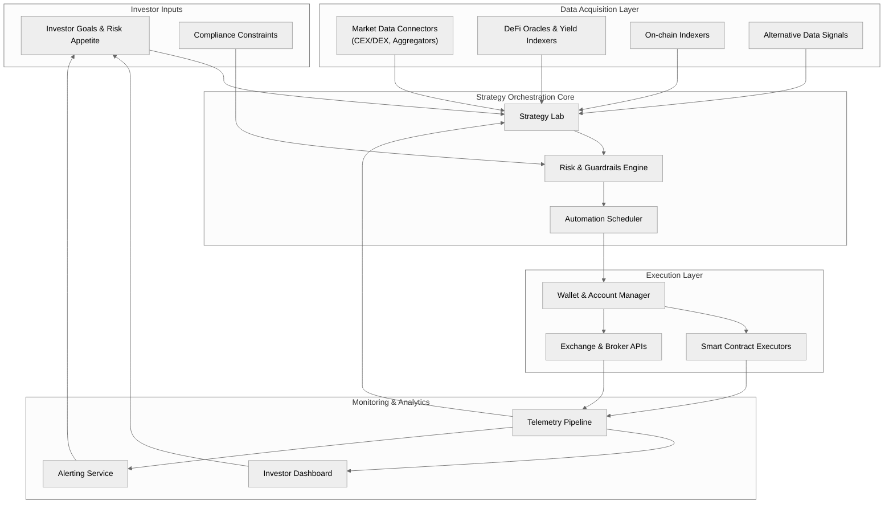

# Passive Income Engine — System Map

The Passive Income Engine coordinates data ingestion, strategy orchestration, and automated execution across multiple financial venues. The system map below highlights the major subsystems and how they exchange information to deliver resilient, compliant yield strategies.



## Editing the diagram

- Update the source diagram in `docs/passive-income-engine/Passive_Income_Engine_System_Map.mmd`.
- Optional: regenerate a static asset for PDFs or slide decks with the Mermaid CLI.

```bash
npm i -g @mermaid-js/mermaid-cli
mmdc -i docs/passive-income-engine/Passive_Income_Engine_System_Map.mmd \
     -o docs/passive-income-engine/Passive_Income_Engine_System_Map.svg \
     -b transparent
```

> MkDocs users: make sure the `mermaid2` plugin is enabled alongside `pymdownx.superfences` and `pymdownx.tabbed` in `mkdocs.yml` so the diagram renders during documentation builds.
