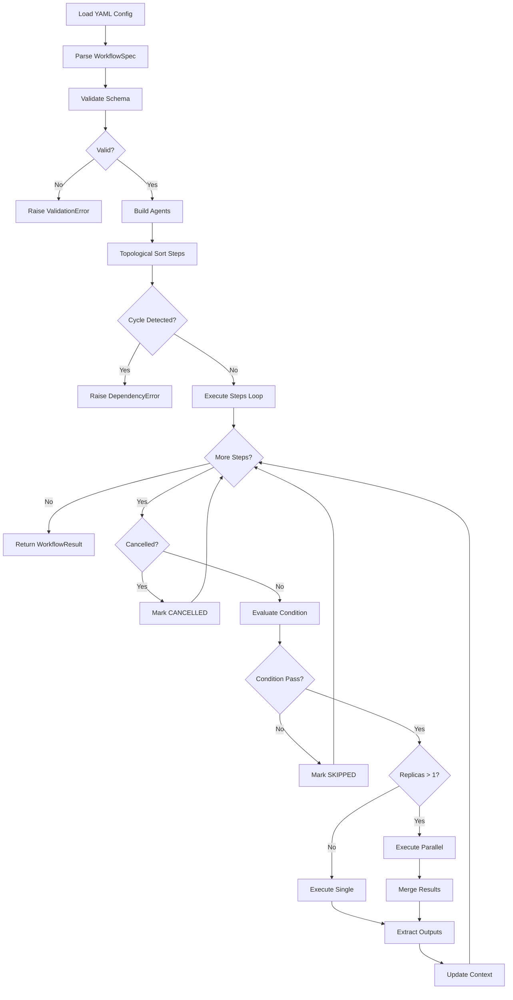
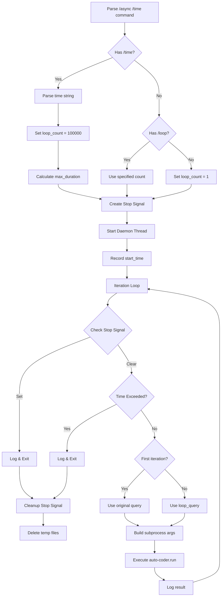
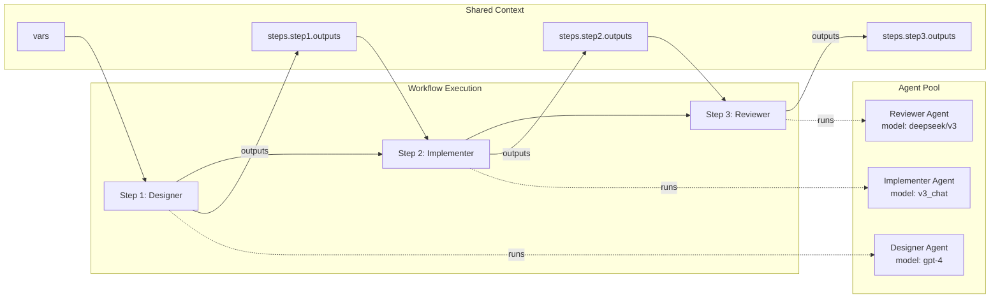
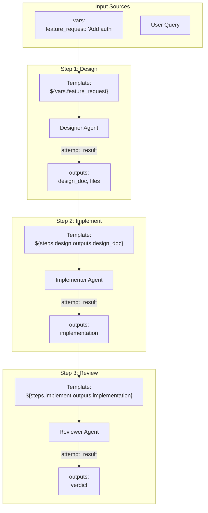
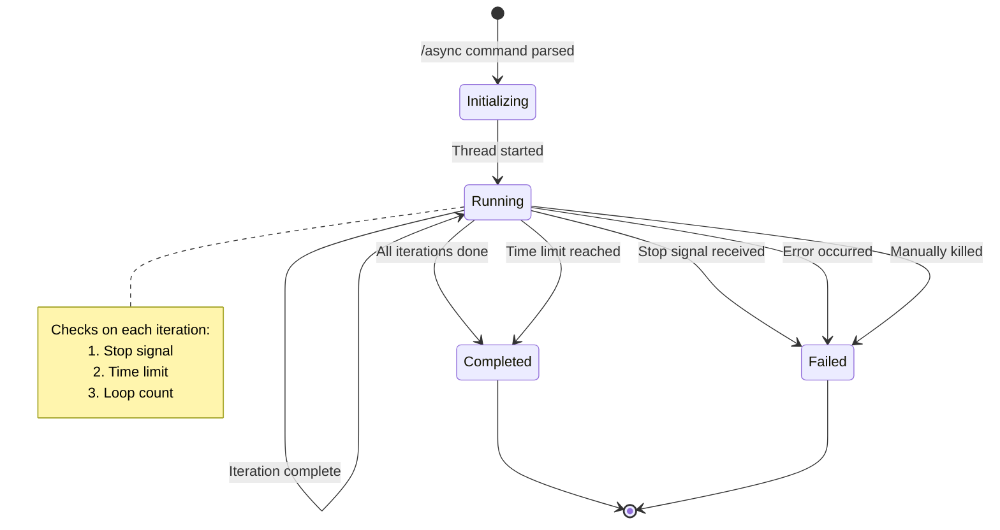
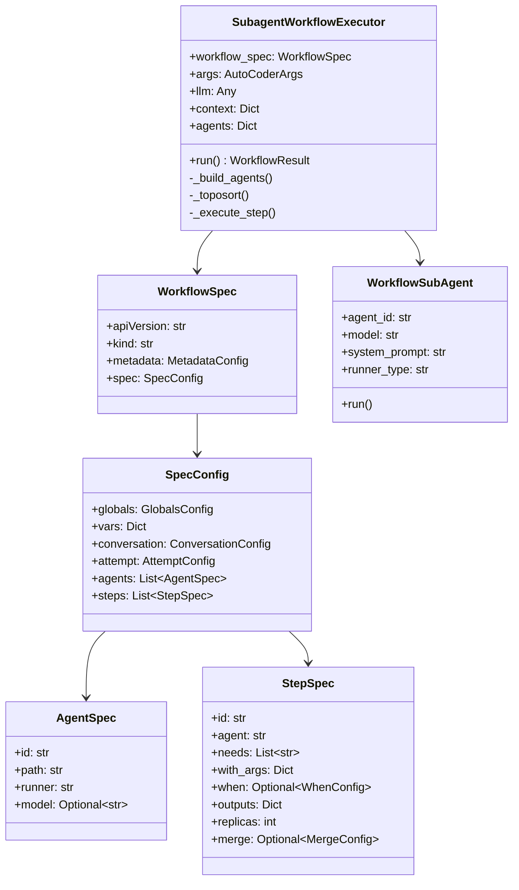
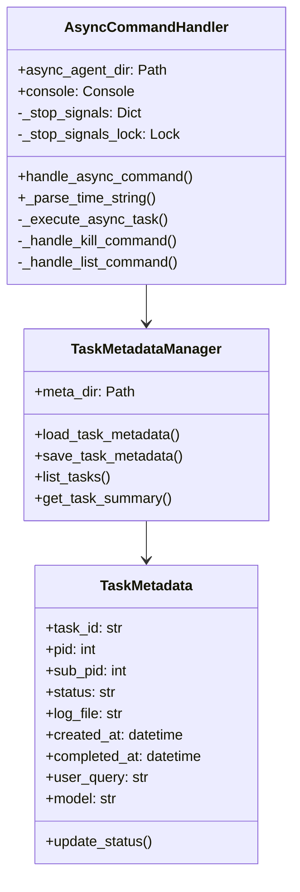
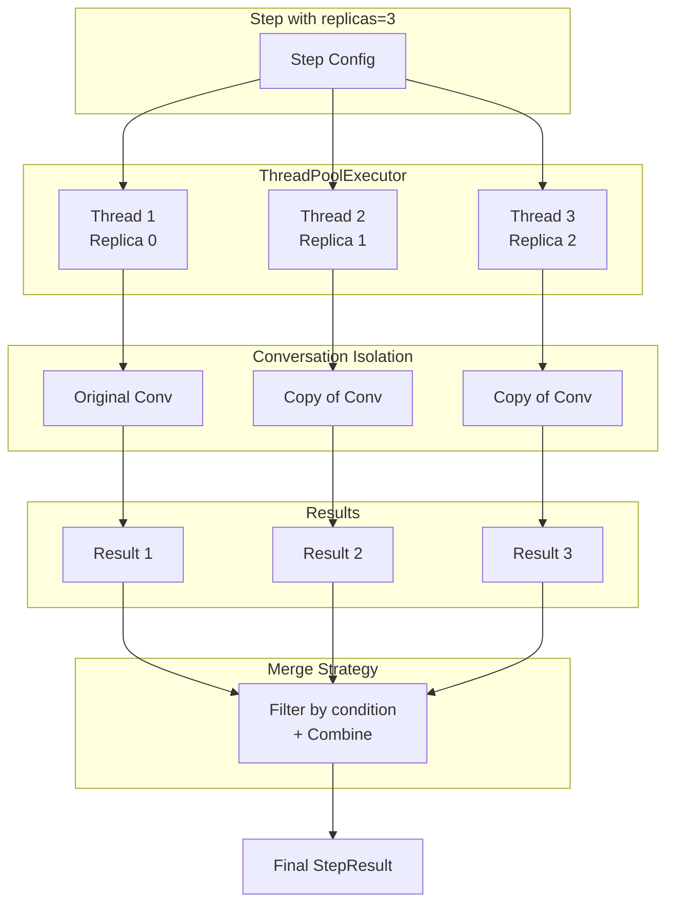
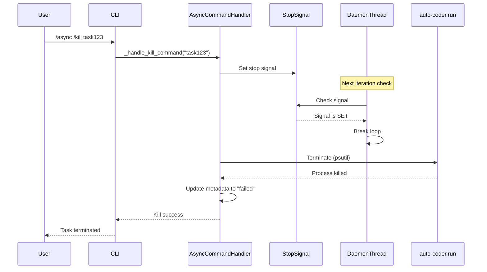
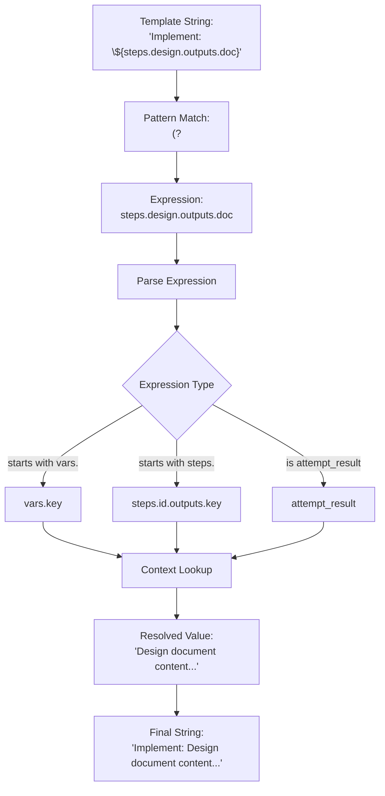

# Architecture Diagrams

> Visual representation of Auto-Coder's workflow and async execution systems.

## Table of Contents

1. [Workflow Execution Flow](#1-workflow-execution-flow)
2. [Async Time Execution Flow](#2-async-time-execution-flow)
3. [Multi-Agent Coordination](#3-multi-agent-coordination)
4. [Context Data Flow](#4-context-data-flow)
5. [Task Lifecycle](#5-task-lifecycle)
6. [Component Architecture](#6-component-architecture)

---

## 1. Workflow Execution Flow

---

## 2. Async Time Execution Flow

---

## 3. Multi-Agent Coordination

---

## 4. Context Data Flow

---

## 5. Task Lifecycle

---

## 6. Component Architecture

### 6.1 Workflow System Components

### 6.2 Async Command Components

---

## 7. Parallel Replica Execution

---

## 8. Stop Signal Flow

---

## 9. Template Resolution Flow

