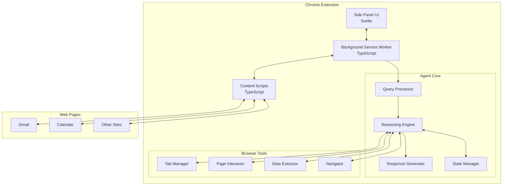

# Codex Chrome Extension Specification

## Overview
Convert the Codex terminal-based coding agent (codex-rs) into a Chrome extension that can automate web browser tasks. The extension will maintain the core agent reasoning logic while replacing file system operations with browser automation capabilities.

## Background
The current Codex agent (codex-rs) is a terminal-based application written in Rust that accepts user queries and modifies code files. This specification outlines the conversion to a Chrome extension that can:
- Accept user queries through a side panel interface
- Automate browser tasks (open tabs, click buttons, fill forms, read content)
- Process web pages and interact with web applications
- Maintain the core agent reasoning and query processing logic

## Requirements

### Functional Requirements

#### Core Agent Logic Preservation
1. **Query Processing Pipeline**: Maintain the same query processing flow as codex-rs
2. **Agent Reasoning**: Keep the core reasoning engine and decision-making logic
3. **Response Generation**: Preserve the response formatting and user interaction patterns
4. **State Management**: Adapt the state management system for browser context

#### User Interface
1. **Chrome Side Panel**: Implement as a Chrome extension side panel web page, using svelte + tailwind
2. **Input Interface**: Text input for user queries/commands
3. **Response Display**: Rich text display for agent responses with code highlighting
4. **Status Indicators**: Show agent processing status and current operations
5. **History**: Maintain query/response history within session

#### Browser Automation Tools
Replace file system tools with browser automation tools:
1. **Tab Management**
   - Open new tabs with specified URLs
   - Close tabs
   - Switch between tabs
   - Get list of open tabs

2. **Page Interaction**
   - Click elements (buttons, links, etc.)
   - Fill form fields
   - Submit forms
   - Scroll page
   - Take screenshots

3. **Content Reading**
   - Extract text content from pages
   - Read specific elements by selector
   - Parse structured data (tables, lists)
   - Monitor page changes

4. **Navigation**
   - Navigate to URLs
   - Go back/forward in history
   - Refresh pages
   - Wait for page load

5. **Data Extraction**
   - Extract emails from Gmail
   - Read calendar entries
   - Parse search results
   - Extract data from web applications

### Technical Requirements

#### Technology Stack
1. **Language**: TypeScript (converted from Rust)
2. **UI Framework**: Svelte for the side panel interface
3. **Build System**: Vite for development and production builds
4. **Chrome APIs**: Manifest V3 compliance
5. **Testing**: Vitest for unit tests, Playwright for integration tests

#### Architecture
1. **Background Service Worker**: Handle long-running agent tasks
2. **Side Panel UI**: Svelte-based user interface
3. **Content Scripts**: Inject into web pages for interaction
4. **Message Passing**: Chrome runtime messaging between components
5. **Storage**: Chrome storage API for persistence

#### Code Structure
```
codex-chrome/
├── src/
│   ├── agent/           # Core agent logic (converted from Rust)
│   │   ├── query/       # Query processing
│   │   ├── reasoning/   # Agent reasoning engine
│   │   ├── response/    # Response generation
│   │   └── state/       # State management
│   ├── background/      # Service worker
│   ├── sidepanel/       # Svelte UI components
│   │   ├── components/  # UI components
│   │   ├── stores/      # Svelte stores
│   │   └── App.svelte   # Main app component
│   ├── content/         # Content scripts
│   ├── tools/           # Browser automation tools
│   │   ├── tabs/        # Tab management
│   │   ├── interaction/ # Page interaction
│   │   ├── navigation/  # Navigation tools
│   │   └── extraction/  # Data extraction
│   └── types/           # TypeScript type definitions
├── manifest.json        # Chrome extension manifest
├── package.json         # Node dependencies
└── tsconfig.json        # TypeScript configuration
```

### Non-Functional Requirements

#### Performance
1. **Response Time**: Agent should respond within 5 seconds for simple queries
2. **Memory Usage**: Stay within Chrome extension memory limits
3. **CPU Usage**: Minimize CPU usage during idle state

#### Security
1. **Permissions**: Request minimum required permissions
2. **Content Security Policy**: Implement strict CSP
3. **Data Privacy**: No user data sent to external servers
4. **Secure Communication**: Use Chrome's secure message passing

#### Compatibility
1. **Chrome Version**: Support Chrome 120+
2. **Manifest Version**: Use Manifest V3
3. **Web Standards**: Follow W3C standards for DOM manipulation

## Design

### System Architecture



### Data Flow

1. **User Query Input**
   - User enters query in side panel
   - Query sent to background worker
   - Background worker invokes query processor

2. **Query Processing**
   - Query processor parses user input
   - Reasoning engine determines required actions
   - State manager tracks operation context

3. **Tool Execution**
   - Reasoning engine calls appropriate browser tools
   - Tools interact with web pages via content scripts
   - Results returned to reasoning engine

4. **Response Generation**
   - Response generator formats results
   - Response sent to side panel
   - UI updates with agent response

### Tool Interfaces

```typescript
// Tab Management Interface
interface TabManager {
  openTab(url: string, active?: boolean): Promise<chrome.tabs.Tab>;
  closeTab(tabId: number): Promise<void>;
  switchToTab(tabId: number): Promise<void>;
  getAllTabs(): Promise<chrome.tabs.Tab[]>;
  getCurrentTab(): Promise<chrome.tabs.Tab>;
}

// Page Interaction Interface
interface PageInteractor {
  click(selector: string, tabId: number): Promise<void>;
  type(selector: string, text: string, tabId: number): Promise<void>;
  submit(selector: string, tabId: number): Promise<void>;
  scroll(x: number, y: number, tabId: number): Promise<void>;
  screenshot(tabId: number): Promise<string>;
}

// Data Extraction Interface
interface DataExtractor {
  getText(selector: string, tabId: number): Promise<string>;
  getHTML(selector: string, tabId: number): Promise<string>;
  getAttribute(selector: string, attribute: string, tabId: number): Promise<string>;
  getAllElements(selector: string, tabId: number): Promise<Element[]>;
  waitForElement(selector: string, tabId: number, timeout?: number): Promise<void>;
}

// Navigation Interface
interface Navigator {
  goto(url: string, tabId: number): Promise<void>;
  back(tabId: number): Promise<void>;
  forward(tabId: number): Promise<void>;
  refresh(tabId: number): Promise<void>;
  waitForNavigation(tabId: number, timeout?: number): Promise<void>;
}
```

## Implementation Plan

### Phase 1: Project Setup and Core Conversion (Week 1-2)
1. **Project Initialization**
   - Create codex-chrome directory structure
   - Setup TypeScript, Vite, and Svelte
   - Configure Chrome extension manifest

2. **Core Logic Conversion**
   - Convert agent query processing from Rust to TypeScript
   - Port reasoning engine maintaining function names
   - Adapt state management for browser context

### Phase 2: Chrome Extension Infrastructure (Week 3)
1. **Extension Components**
   - Implement background service worker
   - Create side panel with Svelte
   - Setup content script injection
   - Implement message passing system

2. **UI Development**
   - Design and implement side panel interface
   - Create input and output components
   - Add status indicators and history

### Phase 3: Browser Tool Implementation (Week 4-5)
1. **Basic Tools**
   - Implement tab management tools
   - Create page navigation tools
   - Add basic click and type interactions

2. **Advanced Tools**
   - Implement form submission
   - Add data extraction capabilities
   - Create screenshot functionality
   - Build element waiting mechanisms

### Phase 4: Integration and Testing (Week 6)
1. **Integration**
   - Connect agent core with browser tools
   - Test complete query flows
   - Implement error handling

2. **Testing**
   - Unit tests for core logic
   - Integration tests for tools
   - End-to-end tests for common scenarios

### Phase 5: Optimization and Polish (Week 7)
1. **Performance**
   - Optimize memory usage
   - Reduce response times
   - Minimize CPU usage

2. **User Experience**
   - Refine UI design
   - Add helpful error messages
   - Improve status feedback

## Testing Strategy

### Unit Testing
- Test each agent component independently
- Mock Chrome APIs for isolated testing
- Achieve 80% code coverage

### Integration Testing
- Test tool interactions with real web pages
- Verify message passing between components
- Test state persistence

### End-to-End Testing
Test complete user scenarios:
1. **Gmail Automation**: Read unread emails and auto-reply
2. **Calendar Integration**: Schedule meetings
3. **Form Filling**: Complete web forms automatically
4. **Data Extraction**: Extract structured data from pages

### Performance Testing
- Measure response times for various queries
- Monitor memory usage during operations
- Test with multiple concurrent tabs

## Migration Guide

### For Developers
1. **Code Mapping**: Reference table showing Rust to TypeScript conversions
2. **API Changes**: Document changes in function signatures
3. **Tool Replacements**: Map file operations to browser operations

### For Users
1. **Installation**: Step-by-step Chrome extension installation
2. **Usage**: Guide for using the side panel interface
3. **Query Examples**: Sample queries for common tasks

## Risks and Mitigations

### Technical Risks
1. **Risk**: Chrome API limitations
   - **Mitigation**: Research API capabilities early, design workarounds

2. **Risk**: Performance issues with complex pages
   - **Mitigation**: Implement timeouts and resource limits

3. **Risk**: Content Security Policy restrictions
   - **Mitigation**: Design within CSP constraints, use message passing

### Security Risks
1. **Risk**: Excessive permissions required
   - **Mitigation**: Minimize permissions, use activeTab when possible

2. **Risk**: XSS vulnerabilities in content scripts
   - **Mitigation**: Sanitize all inputs, use secure DOM manipulation

## Success Criteria

1. **Functional**: Successfully convert 90% of core agent logic
2. **Performance**: Response time under 3 seconds for 80% of queries
3. **Reliability**: 99% success rate for basic browser operations
4. **Usability**: Intuitive interface requiring no documentation for basic use
5. **Compatibility**: Works on top 10 most visited websites

## Example Use Cases

### Use Case 1: Email Management
```
User: "Review job applications in my Gmail and schedule interviews"
Agent:
1. Opens Gmail tab
2. Searches for unread emails with "job application"
3. Extracts applicant information
4. Composes reply emails with interview links
5. Opens calendar and creates interview slots
```

### Use Case 2: Form Automation
```
User: "Fill out the expense report on the company portal"
Agent:
1. Navigates to company portal
2. Logs in (if credentials saved)
3. Finds expense report form
4. Fills in fields from saved data
5. Submits form
6. Confirms submission
```

### Use Case 3: Data Collection
```
User: "Collect all product prices from these 5 competitor websites"
Agent:
1. Opens tabs for each website
2. Searches for products
3. Extracts pricing information
4. Compiles data into structured format
5. Presents summary to user
```

## Appendices

### A. Removed Components
The following codex-rs components will not be ported:
- file-search/ - File system search not applicable
- linux-sandbox/ - No sandboxing needed in browser
- login/ - Use Chrome's authentication
- mcp-* - MCP protocol not used
- ollama/ - Local LLM not supported
- tui/ - Terminal UI replaced by web UI

### B. Chrome Extension Permissions
Required permissions in manifest.json:
- tabs
- activeTab
- storage
- scripting
- webNavigation

### C. TypeScript Configuration
Key compiler options:
- strict: true
- target: ES2020
- module: ESNext
- lib: ["ES2020", "DOM", "Chrome"]

### D. Development Tools
- Chrome Extension Developer Tools
- Svelte DevTools
- TypeScript Language Service
- Vite HMR for rapid development