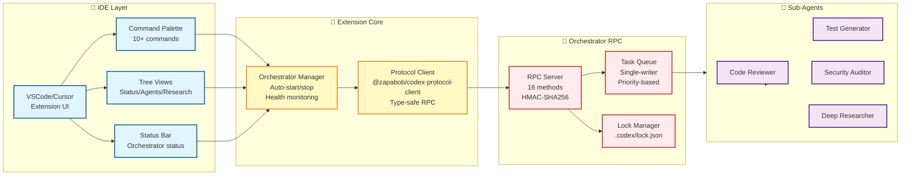

# Codex AI Assistant for VSCode/Cursor

**Version**: 0.57.0  
**Author**: zapabob  
**License**: Apache-2.0  
**Published**: 2025-11-02

## Overview

Autonomous AI coding assistant with sub-agent orchestration and deep research capabilities, integrated directly into VSCode and Cursor IDE. This extension provides seamless access to the Codex Orchestrator RPC server, enabling task delegation, code review, deep research, and real-time agent monitoring from within your editor.

## Features

### 🎯 Orchestrator Integration
- **Auto-start Orchestrator**: Automatically starts the Codex Orchestrator RPC server
- **Status Monitoring**: Real-time monitoring of orchestrator status, agents, and tasks
- **Transport Options**: Support for TCP, Unix Domain Socket, and Named Pipe

### 🤖 Sub-Agent Delegation
- **Code Reviewer**: Review code for security, performance, and best practices
- **Test Generator**: Automatically generate unit and integration tests
- **Security Auditor**: Scan for vulnerabilities and security issues
- **Refactorer**: Suggest and apply code refactorings
- **Architect**: Design and plan system architecture

### 🔍 Deep Research
- **Multi-source Research**: Search and analyze multiple sources
- **Citation-based Reporting**: Get research results with proper citations
- **Gemini Integration**: Leverage Google Gemini for enhanced research

### 📊 Visual Interface
- **Orchestrator Status View**: Monitor orchestrator health and performance
- **Active Agents View**: See all running agents and their status
- **Research History View**: Browse past research queries and results
- **MCP Servers View**: Manage MCP server connections

### ⌨️ Keyboard Shortcuts
- `Ctrl+Shift+D`: Delegate task to agent
- `Ctrl+Shift+R`: Start deep research
- `Ctrl+Shift+C`: Review selected code

## Installation

### Prerequisites

1. Install Codex CLI:
```bash
cargo install --path codex-rs/cli --force
```

2. Verify installation:
```bash
codex --version
# Should show: codex-cli 0.57.0 or later
```

### Install Extension

**From VSIX:**
```bash
code --install-extension codex-assistant-0.57.0.vsix
```

**From Marketplace:** (Coming soon)
1. Open VSCode/Cursor
2. Go to Extensions (Ctrl+Shift+X)
3. Search for "Codex AI Assistant"
4. Click Install

## Configuration

### Orchestrator Settings

```json
{
  "codex.orchestrator.autoStart": true,
  "codex.orchestrator.transport": "tcp",
  "codex.orchestrator.port": 9876
}
```

### Gemini Settings

```json
{
  "codex.gemini.authMethod": "oauth"
}
```

### Research Settings

```json
{
  "codex.research.maxDepth": 3,
  "codex.research.maxSources": 10
}
```

## Usage

### Starting Orchestrator

**Automatic** (default):
- Orchestrator starts automatically when extension activates

**Manual**:
1. Press `Ctrl+Shift+P`
2. Run `Codex: Start Orchestrator`

### Delegating Tasks

1. Select code (optional)
2. Press `Ctrl+Shift+D` or right-click → `Codex: Delegate Task to Agent`
3. Enter task description
4. Select agent type
5. Wait for completion notification

### Deep Research

1. Press `Ctrl+Shift+R` or Command Palette → `Codex: Deep Research`
2. Enter research query
3. Wait for results
4. View results in Research History view

### Code Review

1. Select code in editor
2. Press `Ctrl+Shift+C` or right-click → `Codex: Review Selected Code`
3. Review appears in output panel

## Architecture

### System Overview



### Protocol

Uses `@zapabob/codex-protocol-client` for type-safe RPC communication:

```typescript
import { OrchestratorClient } from '@zapabob/codex-protocol-client';

const client = new OrchestratorClient({
  transport: { preference: 'tcp', port: 9876 }
});

await client.connect();
await client.taskSubmit({ 
  agent_type: 'code-reviewer',
  description: 'Review this code...'
});
```

## Cursor IDE Integration

### MCP Protocol Support

Codex integrates seamlessly with Cursor's MCP protocol:

1. **Automatic Detection**: Extension detects Cursor environment
2. **MCP Server Registration**: Registers Codex as MCP server
3. **Bi-directional Communication**: Shares context with Cursor's AI

### Cursor-Specific Features

- **Composer Integration**: Use `@codex` in Cursor Composer
- **Tab Completion**: Codex suggestions in autocomplete
- **Inline Diagnostics**: Real-time code analysis

## Troubleshooting

### Orchestrator Won't Start

1. Check Codex CLI is installed:
```bash
which codex  # Unix
where codex  # Windows
```

2. Check logs:
```bash
tail -f .codex/logs/orchestrator_*.log
```

3. Manually start orchestrator:
```bash
codex orchestrator start --port 9876
```

### Connection Failed

1. Verify orchestrator is running:
```bash
codex orchestrator status
```

2. Check port availability:
```bash
netstat -an | grep 9876  # Unix
netstat -an | findstr 9876  # Windows
```

3. Try different transport:
```json
{
  "codex.orchestrator.transport": "named-pipe"
}
```

## Development

### Build from Source

```bash
cd extensions/vscode-codex
npm install
npm run compile
```

### Package Extension

```bash
npm run package
# Creates: codex-assistant-0.56.0.vsix
```

### Test Extension

```bash
npm run test
```

## Contributing

See [CONTRIBUTING.md](../../CONTRIBUTING.md) for guidelines.

## License

Apache-2.0 - see [LICENSE](../../LICENSE)

## Links

- **GitHub**: https://github.com/zapabob/codex
- **Documentation**: https://github.com/zapabob/codex/tree/main/docs
- **Issues**: https://github.com/zapabob/codex/issues

## Changelog

### 0.57.0 (2025-11-02)

**Blueprint Mode Release** 🎯

- ✅ Blueprint Mode (read-only planning phase)
- ✅ Execution strategies (single/orchestrated/competition)
- ✅ Slash commands (/blueprint, /approve, /reject, /mode, /deepresearch)
- ✅ Privacy-respecting telemetry
- ✅ Webhook integrations (GitHub/Slack/HTTP)
- ✅ DeepResearch integration with approval dialogs
- ✅ Budget enforcement (token/time limits)
- ✅ Shift+Tab keybinding for blueprint toggle

### 0.56.0 (2025-11-01)

**Initial Release** 🎉

- ✅ VSCode/Cursor extension implementation
- ✅ Orchestrator integration
- ✅ Sub-agent delegation
- ✅ Deep research support
- ✅ MCP protocol integration
- ✅ Keyboard shortcuts
- ✅ Status monitoring views

---

**Made with ❤️ by zapabob**

