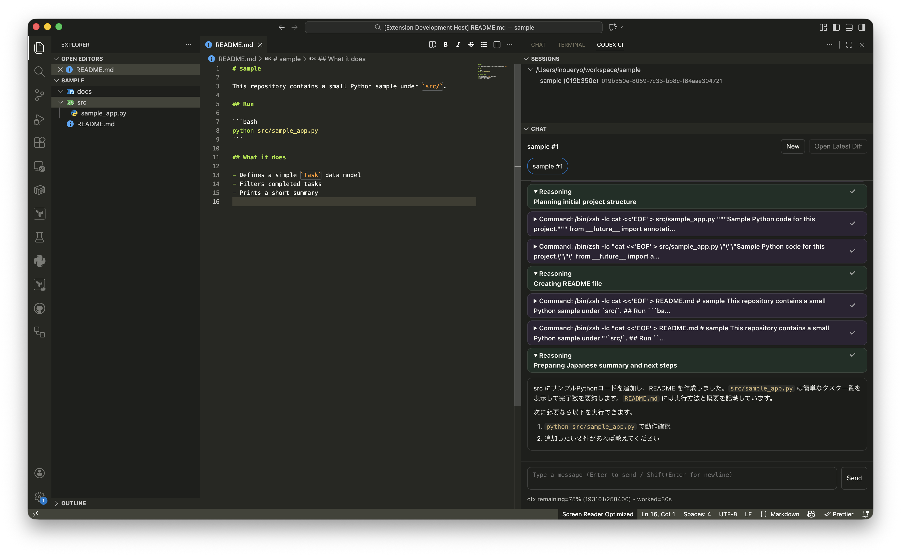

# Codex UI (VS Code Extension)

Use **Codex CLI** (via `codex app-server`) inside VS Code.

This extension:

- Starts / connects to the Codex CLI app-server per workspace folder
- Manages sessions (create, switch, rename, hide)
- Shows chat output including tool events (commands, file changes, diffs, approvals)

## Prerequisites (Codex CLI)

This extension **does not bundle Codex CLI**.

- Install Codex CLI separately and make sure `codex` is available in your `PATH`.
- Or set the full path via settings (`codexMine.backend.command`).

## Usage



1. Open the Activity Bar view: **Codex UI**
2. Click **New** to create a session
3. Type in the input box (Enter = send, Shift+Enter = newline)
4. Switch sessions from **Sessions** or the chat tab bar

### Settings

- `codexMine.backend.command`
  - Default: `codex`
  - If `codex` is not in your `PATH`, set an absolute path.
- `codexMine.backend.args`
  - Default: `["app-server"]`

## Development

1. Install dependencies

   ```bash
   pnpm install
   ```

2. Build

   ```bash
   pnpm run compile
   ```

3. Run in VS Code
   - Open this repo in VS Code
   - Run the debug configuration: **Run Extension (Codex UI)**

## Publishing (VS Code Marketplace)

1. Update `package.json` (`version`)
2. Package

   ```bash
   pnpm run vsix:package
   ```

3. Publish

   ```bash
   npx @vscode/vsce publish
   ```

## Specification

See `docs/spec.md`.
